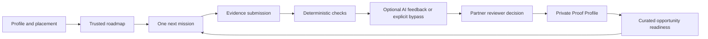
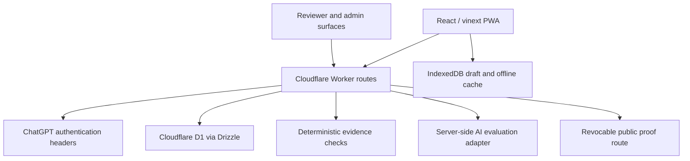

# Design: Lan Pya Operational Proof-to-Opportunity Alpha

Generated by /office-hours on 2026-08-11  
Branch: master  
Repo: local/Lan Pya  
Status: APPROVED  
Mode: Startup

## Problem Statement

Myanmar university students who want a first digital career are learning from scattered sources but do not have a trusted way to answer four linked questions:

1. What role and starting point fit me now?
2. What is the next useful thing I should learn or build?
3. Does my work meet a credible standard?
4. Which opportunity am I ready to pursue, and what evidence can I show?

Lan Pya must solve the complete transition from direction to inspectable proof. It should not become another course catalogue, generic AI adviser, badge system, or undifferentiated job board.

The product promise is:

> Lan Pya helps a learner follow a trusted career path, complete realistic work, turn that work into evidence, and understand the next opportunity they are ready to pursue.

## Demand Evidence

The team supplied 11 survey responses collected in Myanmar between 1 and 3 August 2026. This is early problem evidence, not population-level validation.

- 10 of 11 respondents were university students.
- 9 of 11 selected a digital-technology field: Software Engineering, AI/Data Science, Game Development, or Game Design.
- 5 of 11 selected Software Engineering, making it the largest single field.
- 10 of 11 said they had felt lost about what to learn next.
- 7 of 11 currently learn through YouTube.
- Missing mentorship and a missing clear roadmap were the most common challenges, each appearing four times.
- 9 of 11 said they would complete real-world tasks to unlock opportunities.
- 8 of 11 selected a personalized roadmap as a valuable feature.
- Payment intent was weak and hypothetical: 4 yes, 4 maybe, and 3 no.

Source: `/Users/minbhonesan/Downloads/Lan Pya Website ( AI roadmap ) (Responses).xlsx`, sheet `Form Responses 1`, respondent profile `B2:C12`, problems and current behavior `D2:F12`, product intent `G2:L12`.

Interpretation:

- The survey supports a narrow university and digital-career wedge.
- It does not justify claims about all Myanmar learners or all STEM disciplines.
- It measures stated interest, not repeated use, completed work, employer trust, or willingness to pay.
- The question labeled “MOST valuable” allowed multiple selections, so those answers are directional only.

Public evidence reinforces the problem. The World Bank reports constrained formal employment for educated youth, career and skill mismatch, and a need for career counseling, vocational alignment, and access to online remote and gig work. In October 2025, 18 percent of surveyed firms reported vacancies; 48 percent of firms with vacancies or hiring activity had difficulty attracting workers. Only 44 percent of Myanmar's population was online in January 2025, with affordability, power, and connectivity constraints.

References:

- [World Bank: At Home or Away? Aspirations of Myanmar's high-skilled youth](https://documents1.worldbank.org/curated/en/099022426135038432/pdf/P507826-80708c5f-a68c-441a-8641-374d9034c707.pdf)
- [World Bank: Myanmar Firm Monitoring Survey, Round 20](https://documents1.worldbank.org/curated/en/099022526051041505/pdf/P507203-9236809a-5ebd-416c-a04b-effd44e0a491.pdf)
- [World Bank: Myanmar Economic Monitor, December 2025](https://documents1.worldbank.org/curated/en/099120625204042781/pdf/P507203-7c4662b6-c1d8-4c3c-9b0c-d4835f2763cb.pdf)

## Status Quo

The dominant learner workaround in the survey is self-directed YouTube learning. Learners combine videos, university material, friends, communities, and miscellaneous courses without a shared sequence or evidence standard.

The market already contains separate pieces of the solution:

- Learning platforms provide courses and certificates.
- [Myanmar Cyber Youths](https://www.myanmarcyberyouths.com/) provides mobile-first, project-based technology education and recruitment connections.
- [STEMSphere](https://www.stemspheremm.com/) provides STEM resources, projects, competitions, counseling, and mentoring.
- [JobNet](https://www.jobnet.com.mm/) provides job discovery and applications.
- [Forage](https://www.theforage.com/) shows the global pattern of employer-designed job simulations, model answers, and recruiter connections.

The gap is the connective tissue. A learner can find content and listings, but still lacks a personal starting point, one next action, transparent evaluation, portable evidence, and an explained readiness match.

## Target User & Narrowest Wedge

### Primary user

A Myanmar university student who:

- is pursuing a first software role;
- currently learns through YouTube or other scattered online resources;
- can access a laptop for production work, even if most browsing happens on a phone;
- has irregular connectivity and limited budget;
- has little or no formal work experience;
- needs a clear route to a credible project and an opportunity-readiness explanation.

The team intentionally skipped naming one individual respondent. Until a real learner is recruited, the product is using this composite persona. This is a validation risk, not a substitute for observation.

### First role

Frontend Web Developer.

This role is first because work can be inspected through repositories and deployed URLs, foundational skills are sequenced clearly, deterministic checks are practical, and portfolio evidence matters. The expansion order is:

1. Frontend Web Developer
2. Full-Stack Developer
3. AI/Data Analyst

A later track launches only when it has an expert-owned competency graph, versioned missions, evidence rules, trained reviewers, and current opportunities.

### First paying customer

The learner-facing core remains free. Universities, training organizations, NGOs, scholarship programs, and employers sponsor managed cohorts. Sponsors pay for cohort operations, verification, analytics, and controlled talent access.

## Constraints

### Time

The hackathon pitch is 20 August 2026, nine calendar days after this design decision. The target is an operational vertical slice, not full product breadth.

### Existing product

The repository contains a polished local-persistence prototype built with React 19, Next-compatible app routing through vinext, and Cloudflare Workers. Authentication helpers and Drizzle/D1 integration exist, but the schema is empty and the main learner flow currently stores demo state in the browser.

### Delivery environment

- Responsive web app delivered as an installable PWA.
- Existing ChatGPT Sites and Cloudflare Worker deployment remain the initial hosting path.
- Cloudflare D1 is the persistent store for the operational alpha.
- Evidence uses repository and deployed-site URLs in the August slice. Arbitrary executable uploads are excluded.
- ChatGPT sign-in is the default alpha identity mechanism because it already exists in the project. Email magic-link authentication is a post-hackathon decision.

### Access

- Mobile-first navigation and low-data screens are mandatory.
- Laptop access is required to complete frontend production tasks.
- Core roadmap and mission instructions must remain readable after connectivity drops.
- Draft reflections and submission forms must survive refreshes and reconnects.

### Language

- Critical learner-facing flows are available in Burmese and English.
- Employer vocabulary remains visible in English alongside Burmese explanations.
- Machine translation alone is not sufficient for published mission, rubric, privacy, or error copy.
- Internal admin screens may be English-first for the alpha, provided no learner-facing truth is English-only.

### Trust

- AI cannot award a high-stakes verified status by itself.
- No opportunity may be hidden as a gamified unlock.
- Profiles and evidence are private by default.
- Public sharing is opt-in, revocable, and separate from account identity.

### Team capacity

The operational August scope assumes two product engineers working in parallel, one track/content owner, one Burmese language owner, one reviewer lead, and two trained reviewers.

There are two explicit release baselines:

- **Operational alpha:** two engineers, named content/language/reviewer owners, one end-to-end mission, learner/reviewer/admin roles, optional AI developmental feedback, human verification, proof sharing, and three curated opportunities.
- **Demonstration fallback:** one engineer or missing trust-critical owners. It may use seeded data and shadow AI, but it must be labeled a prototype and may not claim operational verification, partner review, or live opportunity readiness.

Privacy, authorization, and honest trust labels are not removable scope. If the operational alpha lacks its required people or platform capabilities, the release changes claims rather than simulating those capabilities.

## Premises

### Premise 1: STEM is the initial product category

Challenge: broad STEM contains software, laboratories, regulated health work, engineering drawings, field observation, and skilled trades. These require different evidence and reviewer models.

Decision: STEM remains the mission and expansion umbrella. The initial product category is digital-STEM career proof, starting with frontend development.

### Premise 2: Learners need more content

Challenge: local and global course providers already supply content. The survey shows scattered learning and unclear direction rather than an absence of videos.

Decision: Lan Pya curates a small resource set and invests in sequencing, missions, feedback, proof, and opportunity readiness.

### Premise 3: AI personalization creates trustworthy roadmaps

Challenge: a model may omit foundations, invent requirements, or change advice between sessions.

Decision: experts own the competency graph, prerequisites, evidence standards, and rubrics. AI may adapt placement explanations, pacing, and resource suggestions within those boundaries.

### Premise 4: An AI score can verify a learner

Challenge: a single score hides uncertainty and can create unfair opportunity gates.

Decision: verification is layered. Deterministic checks and AI provide developmental feedback. A trained partner reviewer produces the human-verified tier. Lan Pya audits reviewer quality and handles appeals.

### Premise 5: Job listings create opportunity

Challenge: an uncurated listing feed creates stale deadlines, duplicates, scams, and unexplained eligibility.

Decision: the initial opportunity registry is curated by Lan Pya staff and approved partners. Every listing has criteria, source, deadline, status, and last-verified date.

### Premise 6: A hackathon requires only a polished demo

Challenge: the team explicitly wants a workable product, and the current prototype already covers the polished-demo layer.

Decision: build one real vertical slice with identity, database persistence, operational roles, versioned truth, review, proof sharing, and opportunity operations.

## Approaches Considered

### Approach A: Personalized STEM Learning Platform

Courses, quizzes, AI tutoring, and roadmaps across many STEM careers.

Why rejected:

- crowded by existing LMS and course products;
- expensive content burden;
- broad STEM assessment cannot share one verification method;
- optimizes lesson consumption rather than career evidence.

### Approach B: Proof-to-Opportunity Engine

One trusted career graph guides a learner to practical work. Evidence is evaluated against visible criteria, added to a private Proof Profile, and mapped to curated opportunities.

Why selected:

- matches the survey's roadmap and practical-task signals;
- complements existing learning and job platforms;
- produces an inspectable output for employers;
- can be tested as one complete loop;
- creates reusable infrastructure for later tracks.

### Approach C: STEM Career Super-App

Multiple tracks, courses, mentors, scholarships, jobs, remote work, migration guidance, and employer recruitment.

Why rejected now:

- creates simultaneous content, trust, marketplace, safety, and supply problems;
- impossible to operate credibly by 20 August;
- hides the distinctive proof loop inside breadth.

## Recommended Approach

### Positioning

Lan Pya is a proof-to-opportunity engine for Myanmar's emerging digital talent.

It is not a school, job board, psychometric destiny test, or automated hiring system. It coordinates existing learning resources around trusted competency maps and produces evidence that another person can inspect.

### Decision record

| Decision | Locked choice |
|---|---|
| Product category | Proof-to-Opportunity Engine |
| First audience | Myanmar university students pursuing a first digital role |
| First track | Frontend Web Developer |
| Later tracks | Full-Stack Developer, then AI/Data Analyst |
| Roadmap truth | Expert-owned competency graph with bounded AI adaptation |
| Verification | Deterministic checks + optional non-blocking AI feedback + trained partner review + Lan Pya audit |
| First unlocked outcome | Private verified Proof Profile and opportunity-readiness report |
| Opportunity supply | Curated registry managed by Lan Pya and approved partners |
| Delivery | Bilingual, mobile-first PWA |
| Privacy | Private and alias-friendly by default; controlled revocable sharing |
| Business model | Sponsored cohorts; learner core remains free |
| Human verification | Trained partner reviewers using shared rubrics; Lan Pya audits and handles appeals |
| North star | Verified Evidence Rate |
| August milestone | Target: operational vertical slice. Current release baseline remains demonstration fallback until RACI and capability gates pass |

### Core product loop



The first magical moment is not the roadmap animation. It is when a learner sees that a concrete project criterion has become verified evidence and that the same evidence changes an opportunity from `Build toward` to `Ready now`.

### Actors

| Actor | Primary job | Alpha permissions |
|---|---|---|
| Learner | Follow path and create evidence | Manage own profile, drafts, submissions, proof, consent, and share links |
| Reviewer | Apply a published rubric | See assigned submissions, declare conflicts, save review drafts, submit criterion decisions |
| Content/admin operator | Operate the alpha safely | Administer reviewer roles, assign reviews, manage opportunity lifecycle, take safety actions, and inspect seeded track/mission/rubric versions |
| Public proof recipient | Inspect shared evidence | View only the fields contained in an active share token |

No partner can browse private learner profiles. No reviewer can change track content or opportunity requirements. Every privileged read of learner evidence and every privileged or trust-changing write creates an audit event using the schema defined below.

August track, mission, rubric, and translation changes are made through reviewed seed migrations and deployments, not a generalized content-management interface. The admin UI may inspect exact published versions but cannot edit them in place.

### Frontend competency graph

The alpha presents the complete path while emphasizing one next action.

| Milestone | Competencies | Proof-producing mission |
|---|---|---|
| 1. Orientation and tools | Browser tools, editor, files, web basics | Environment and terminology check |
| 2. Semantic HTML | Structure, forms, accessible content | Student profile page |
| 3. CSS and responsive layout | Cascade, spacing, flex/grid, mobile-first design | Responsive profile card |
| 4. JavaScript foundations | Data, functions, events, DOM | Opportunity tracker |
| 5. Git, GitHub, and deployment | Commits, repositories, README, deployment | Published project with history |
| 6. APIs, accessibility, and quality | Fetch, error states, keyboard access, performance | Resilient opportunity explorer |
| 7. Hiring capstone | Integration, decisions, explanation, iteration | Partner-approved frontend brief |

By 20 August, all seven milestones are visible as the trusted Frontend path. **Only the Responsive Profile Card mission is fully operational and eligible for verified proof.** The Opportunity Tracker and partner-style capstone appear as clearly labeled upcoming missions until their briefs and rubrics are calibrated after the pitch.

### Placement

Placement uses evidence precedence:

1. Previously reviewed practical evidence
2. Practical micro-task
3. Deterministic knowledge check
4. Self-report

When signals disagree, Lan Pya recommends the lower supported placement and offers `Test into the next milestone`. `Not sure`, skip, timeout, and interrupted states are valid. Placement is an editable recommendation, not a permanent ability label.

August placement uses a versioned fixed instrument, `frontend-placement-v1`:

- Self-report: prior HTML, CSS, responsive design, JavaScript, and Git/GitHub experience, each with `Yes`, `A little`, or `Not sure`.
- Five deterministic knowledge checks covering semantic HTML, CSS cascade, flex/grid, viewport/responsive behavior, and basic DOM events.
- Optional four-criterion micro-task in which the learner identifies or corrects issues in a supplied static profile card. The task is evaluated locally against fixed expected answers; it does not execute learner code.
- Previously human-verified Lan Pya evidence, if present.

Decision table:

| Highest supported evidence | Starting point | Explanation template |
|---|---|---|
| Current human-verified HTML and CSS evidence compatible with this track version | Milestone 3: Responsive Profile Card | `Your reviewed evidence already supports HTML and CSS foundations.` |
| Micro-task at least 3/4 and knowledge check at least 4/5 | Milestone 3: Responsive Profile Card | `Your practical and knowledge checks support starting with responsive layout.` |
| Knowledge check at least 3/5 and self-report includes prior HTML | Milestone 2: Semantic HTML | `You recognize several foundations; strengthen semantic structure before the mission.` |
| Lower score, skipped checks, timeout, or `Not sure` | Milestone 1: Orientation and tools | `We do not yet have enough evidence for a later start; you can test forward at any time.` |

Self-report alone never places above Milestone 2. If the micro-task and knowledge check disagree, use the lower supported milestone and name the disagreement. A learner override records the recommended milestone, chosen milestone, reason, instrument version, and timestamp. Placement changes the recommendation, not access to roadmap information.

For August, placement controls scaffolding rather than mission availability:

- Milestone 1 starts with an unverified orientation checklist covering editor setup, browser tools, files, and basic web terminology.
- Milestone 2 starts with an unverified semantic-HTML prerequisite checklist and a supplied reference page.
- Completing either checklist routes the learner to the same operational Milestone 3 Responsive Profile Card mission.
- These checklists produce progress state but never verified proof or opportunity readiness by themselves.

### Today recommendation

The dashboard shows one primary action using this order:

1. Resolve a submission, consent, or review blocker.
2. Resume an unfinished mission.
3. Act on a `Ready now` opportunity closing within seven days.
4. Address the next missing rubric criterion.
5. Start the next required mission.
6. Review feedback or set a weekly goal.

The learner may dismiss a recommendation and provide a reason. The system must not keep forcing a dismissed action unless its deadline or safety state changes.

### Mission and submission

Every mission version contains:

- real-world context and expected outcome;
- prerequisites;
- estimated effort and device needs;
- acceptance criteria;
- public rubric;
- allowed evidence types;
- AI-use disclosure prompt;
- source and version history;
- Burmese and English instructions.

The August evidence form for the Responsive Profile Card accepts:

- GitHub repository URL;
- deployed project URL;
- short project explanation;
- learner reflection;
- AI/tool-use disclosure.

Arbitrary file upload and execution are excluded from the operational slice. Pre-submission drafts save only to IndexedDB on the current device. Cross-device draft synchronization is explicitly unsupported in the alpha; the UI says `Saved on this device`. Once submitted, an attempt is immutable on the server. A revision creates a new attempt linked to the previous one. Submission creation uses an idempotency key so reconnects and repeated taps do not create duplicates.

Submission state machine:

```text
Draft
  -> Submitted
  -> Deterministic check running
  -> Automated feedback ready | Automated review inconclusive | Automated review skipped/unavailable
  -> Human review queued
  -> Human review in progress
     |-> Changes requested -> New immutable attempt -> Deterministic check running
     |-> Verified -> Proof item created -> Added to Proof Profile
     |-> Rejected for integrity/safety -> Closed
     |-> Appeal requested -> Appeal review -> Changes requested | Verified | Rejected
```

`Rejected` is reserved for integrity, safety, or clearly invalid evidence. Ordinary quality gaps produce `Changes requested` with criterion-level guidance.

### Layered verification

| Layer | Can do | Cannot do |
|---|---|---|
| Deterministic | Validate URL shape, reachability, required fields, repository visibility, and evidence completeness | Claim design quality, authorship, or job readiness |
| AI developmental review | Apply the visible rubric to submitted text and deterministic findings; suggest improvements; disclose uncertainty | Award human-verified status or silently infer protected traits |
| Partner reviewer | Inspect linked evidence, score each criterion, request changes, or verify | Browse unrelated learners or hide conflicts |
| Lan Pya audit | Calibrate reviewers, sample decisions, resolve appeals, suspend broken rubrics | Rewrite an audit trail or expose private work without consent |

AI output must include rubric version, criterion, finding, evidence reference, confidence, limitation, and suggested next action. A numeric score may summarize criteria but never appears alone.

AI is non-blocking in the operational baseline. Deterministic checks plus human review constitute the minimum operational verification path. If the AI provider is unavailable, fails, or times out, the submission remains valid and proceeds to human review with `Automated review unavailable`. No verification state is lost and no acceptance criterion depends on AI success.

Lan Pya's AI-processing consent is separate from the learner's disclosure of AI tools used to create the project. At submission, AI feedback is default-off until the learner accepts a versioned explanation of which submission fields will be sent, the provider, purpose, retention, and human-review alternative. The system records consent version and timestamp. Declining or withdrawing this consent creates `Automated review skipped` and routes directly to human review without reducing the result.

For the August alpha, AI evaluates structured learner text and deterministic results only. It does not clone, execute, or send arbitrary repositories to a model. Human reviewers inspect functionality through the submitted public links.

#### Deterministic URL-check contract

- Accepted evidence schemes are public `https://` URLs. Repository evidence is limited to public `github.com/{owner}/{repo}` URLs in the alpha.
- The alpha requires evidence repositories to be public. A GitHub 404 is `Fail: repository not publicly reachable`; the product does not claim whether the repository is private or nonexistent.
- Each fetch has a five-second timeout, a maximum of three redirects, a 256 KB response limit, and blocks loopback, link-local, private-network, metadata-service, non-HTTP, and credential-bearing destinations.
- Checks use `HEAD` where supported and a bounded `GET` fallback. They never execute scripts, clone repositories, or follow download links.
- Each check returns `Pass`, `Fail`, or `Inconclusive` with a machine-readable reason.
- `Fail` means malformed/disallowed URL, confirmed not found, or missing mission-required evidence. It blocks automated completeness but still permits correction.
- `Inconclusive` covers timeout, rate limit, authorization requirement, upstream 5xx, or safe-fetch refusal. It never lowers a rubric result and routes the evidence to the reviewer.
- Mission versions state which URL types are mandatory. The Responsive Profile Card requires one reachable public repository and one reachable public deployment. There is no screenshot fallback in the alpha.

### Reviewer operations

- Assignment states are `Offered`, `Accepted`, `Declined`, `Expired`, `Reassigned`, `Completed`, and `Cancelled`.
- An offer expires after 24 hours. An accepted assignment has a 48-hour lease for the alpha. The reviewer lead may extend it once with a recorded reason.
- Declined, expired, suspended, or overdue assignments return to the reviewer lead for reassignment. Only one active assignment may exist for one submission attempt.
- A reviewer must accept the assignment and declare conflicts.
- The rubric is immutable for a submitted mission version.
- Reviewers score each criterion as `Meets`, `Partly meets`, `Does not yet meet`, or `Unable to assess`.
- Every non-meeting criterion requires actionable feedback.
- Final verification requires all mandatory criteria to meet the rubric.
- Review submission is atomic and creates an audit event.
- An appeal goes to a different reviewer or the reviewer lead.
- Lan Pya audits at least 20 percent of early reviews and tracks criterion-level agreement.

If no reviewer is available, the submission remains `Human review queued`; it cannot time out into verification. The learner sees the delay and may withdraw the attempt without losing the draft evidence.

The target turnaround for the alpha mission is two business days. The UI shows the actual queue state, not an invented countdown.

Learner sites are untrusted content. Lan Pya never embeds them in the reviewer interface. Evidence links open in a separate tab with `noopener,noreferrer` after an explicit warning. Reviewers are instructed not to enter credentials, install software, approve notifications, or download files, and to use a dedicated browser profile for alpha reviews. A suspicious site is closed and escalated without penalizing the learner until the evidence can be inspected safely.

### Proof Profile

The Proof Profile is private by default and separates identity from public presentation.

It contains:

- learner-chosen display name or alias;
- target role;
- verified proof items;
- project context and artifacts;
- criterion-level results;
- evaluator tier, reviewer organization, rubric version, and evaluation date;
- learner reflection and declared AI/tool use;
- current competency coverage;
- last updated date.

It excludes email, raw diagnostic answers, private drafts, demographic data, and unrelated submissions.

Sharing first creates an immutable packet containing exactly the proof items, proof-item fields, alias, target role, and competency summary the learner previewed. Packet-level profile values are snapshots with source profile and track versions; public rendering never resolves mutable live profile fields. A high-entropy token references that packet and has a 30-day default expiry. The learner may revoke it immediately and generate a new packet and token. Public pages display the generation date and current revocation/expiry status. If an included proof is safety-invalidated, every token referencing a packet that includes it is revoked through packet membership. Live account, token, and included-proof validity are still checked before rendering the immutable snapshot.

Share-token security contract:

- Generate 256 random bits with a cryptographically secure generator and expose the token once.
- Store only a SHA-256 token hash and compare hashes in constant time.
- Check token status, expiry, proof validity, and learner account state atomically on every request.
- Return `Cache-Control: private, no-store`, `X-Robots-Tag: noindex, nofollow`, and `Referrer-Policy: no-referrer`.
- Do not load third-party scripts, analytics, fonts, or images on public proof pages.
- Never place a share token in analytics, audit metadata, error messages, or server logs.
- Revocation takes effect on the next request and is idempotent.

### Content retirement and invalidation

Mission and rubric versions have two withdrawal modes:

- `RetiredForNewStarts`: no new learner may start the version. Existing drafts may submit for seven days, and existing verified proof remains valid against its recorded version.
- `InvalidatedForSafety`: all drafts and pending reviews stop; the mission no longer supports readiness; affected proof items become `Invalidated`; share tokens containing them are revoked; learners and reviewers receive a reason and remediation path.

A normal content improvement creates a new version and does not rewrite old submissions. A competency-compatibility record determines whether older verified criteria still satisfy a current opportunity requirement. Safety invalidation always overrides compatibility.

### Opportunity registry and readiness

Each opportunity has a stable identity, immutable content versions, and append-only lifecycle events. An opportunity version stores:

- title, organization, type, and description;
- source URL and source owner;
- eligibility and mandatory requirement tags;
- location, remote status, compensation or cost;
- application method;
- deadline with timezone;
- safety and sponsorship labels;
- last-verified timestamp;
- source and content version number.

Lifecycle events set the effective state to `Draft`, `Published`, `Expired`, `Cancelled`, or `Removed` without rewriting a published version. Correcting eligibility, deadline, or source creates a new immutable version and a publication event that points to it. Expiry, cancellation, removal, and restoration append events with actor, timestamp, and reason.

Readiness is explainable:

- `Ready now`: all mandatory skill tags are supported by current evidence and learner-confirmed non-skill eligibility matches.
- `Build toward`: career-relevant, with one or more named gaps that map to a published mission.
- `Explore`: useful for awareness but not a near-term match.
- `Cannot determine`: required eligibility data is missing or ambiguous.

Deterministic readiness decision table:

| Condition | Result |
|---|---|
| Opportunity is not `Published` or deadline has passed | Not shown in active results; retain history |
| A mandatory non-skill eligibility field is unknown | `Cannot determine`, with the exact missing question |
| A mandatory non-skill eligibility field is confirmed false | `Explore`, labeled `Eligibility does not currently match` |
| Every mandatory competency requirement has at least one valid human-verified proof item and all non-skill fields match | `Ready now` |
| At least one mandatory competency is missing and every missing competency maps to an available mission | `Build toward` |
| Missing competencies have no available mission or the opportunity is outside the selected role | `Explore` |

A competency is supported only when a criterion result is `Meets`, evaluator tier is human reviewer or stronger, the proof and mission version are not safety-invalidated, the learner has not deleted the proof, and any requirement-specific `max_age_days` is satisfied. `Partly meets`, AI-only results, and `Unable to assess` do not satisfy mandatory requirements. Multiple valid proof items may collectively satisfy different competency requirements.

Rubric updates do not silently erase proof. Each new rubric or competency version declares compatibility with earlier criterion IDs. Incompatible evidence remains visible in the Proof Profile but no longer satisfies the changed requirement until re-reviewed. Readiness recomputes when proof is verified, invalidated, revoked, or deleted; opportunity requirements change; an opportunity changes state; learner eligibility changes; or a compatibility mapping changes.

Cross-version competency resolution uses stable competency keys:

1. Every track version defines competencies with a stable key such as `frontend.semantic_html` and a versioned meaning.
2. Every rubric criterion and opportunity requirement references that stable competency key plus its source track version.
3. If proof and requirement use the same competency meaning version, a valid `Meets` result supports the requirement.
4. If versions differ, an audited compatibility record for the stable key must explicitly say `Compatible`; missing, `Changed`, or `Incompatible` records do not satisfy the requirement.
5. Compatibility approval records the old/new meaning versions, approver, timestamp, and reason. Safety invalidation overrides it.

Lan Pya never claims to submit an external application. It records that the learner opened or marked an application, then asks for optional outcome confirmation.

Expired listings remain in learner history with their final status. Safety reports can unpublish a listing immediately while an administrator investigates.

### Operational alpha architecture



Architecture decisions:

- Keep the existing single-deployment TypeScript stack for the alpha.
- Add D1 rather than introducing a second backend platform.
- Run server-side authorization on every privileged mutation; UI hiding is not authorization.
- Insert the immutable submission, evidence rows, and initial idempotent `evaluation_job` atomically in one D1 transaction or batch, then return the submission response immediately.
- A separately invoked job endpoint claims the job with a lease, performs deterministic checks and the optional AI call, and records success, inconclusive, or retryable failure. The client may safely request the same job again. A scheduled sweeper reclaims expired leases and triggers unclaimed jobs. If a durable queue binding is confirmed during the Aug 11 spike, it may trigger the same job handler; the data contract does not depend on the queue.
- Human review never depends on automated-job success. A failed or exhausted job moves directly to `Human review queued` with the failure reason retained.
- Keep content and rubric records versioned. Published versions are immutable.
- Use structured event records for audit and metrics.
- Do not add R2 until evidence file upload is authorized and its malware, size, and retention controls are designed.

#### Authentication and role-provisioning contract

- Trust only authentication assertions injected by the configured ChatGPT Sites runtime: stable authenticated user subject, email, and optional percent-encoded full name. The stable subject is the account key; email changes do not create a new account.
- The Aug 11 spike must prove that a direct Worker request cannot create a user by spoofing these headers. If the Worker origin is publicly reachable without trusted assertion verification, restrict the origin or do not ship authenticated production claims.
- Every request resolves the current upstream identity and current D1 membership. Role removal therefore takes effect on the next request; no local long-lived role cookie is accepted.
- First successful authentication creates a `users` row transactionally. Profile creation remains separate so consent is explicit.
- Reviewer and admin roles require a one-time, 256-bit, hash-stored invite created by an existing administrator. Invites name the organization and role, expire after 24 hours, and are consumed atomically.
- Role assignment, removal, invite creation, invite use, and failed privileged access are audited.
- Session expiry and sign-out follow the upstream Sites authentication contract. Sensitive POST routes require same-origin requests and CSRF protection appropriate to that contract.
- Local development uses explicit test identities only when the environment is development. Production builds reject development identity headers and seeded administrator credentials.

Production authentication appendix, to be completed and signed during the Aug 11 spike:

| Contract item | Current expected value | Required evidence |
|---|---|---|
| Stable subject assertion | `oai-authenticated-user-id` | Authenticated request and persisted D1 user row |
| Email assertion | `oai-authenticated-user-email` | Authenticated request; never used as primary key |
| Optional full name | `oai-authenticated-user-full-name` with `oai-authenticated-user-full-name-encoding` | Percent-decoding test and malformed-value test |
| Application validation path | `app/chatgpt-auth.ts::getChatGPTUser` plus server authorization wrapper | Route test showing missing assertions produce authentication failure |
| Allowed topology | ChatGPT Sites edge -> deployed Worker only | Direct-origin request cannot inject a trusted subject |
| Unauthenticated failure | Redirect for browser GET; JSON `401` for API request | Staging test for both behaviors |
| Unauthorized failure | JSON/page `403`, audited | Learner attempts reviewer/admin route |
| Staging/local behavior | Explicit development identity fixture only outside production | Production build test rejects fixture headers |

The current repository does not yet prove assertion authenticity or direct-origin rejection. Until the spike attaches the hosting control or signed-assertion mechanism and passes the topology test, the authentication capability is `Unverified` and the demonstration fallback remains the default release baseline.

### Minimum data model

| Entity | Purpose | Key invariants |
|---|---|---|
| `users` | Authenticated account and status | Auth provider ID unique; email never public by default |
| `learner_profiles` | Alias, language, goal, availability, consent pointer | One active profile per user |
| `organizations` and `memberships` | Sponsor, reviewer, and admin roles | Membership role checked server-side |
| `cohorts` and `enrollments` | Sponsored learner groups | Learner may leave without deleting earned private proof |
| `track_versions` | Published frontend competency graph | Published versions immutable |
| `milestones` and `competencies` | Ordered outcomes and prerequisites | Stable IDs across copy edits |
| `mission_versions` and `rubric_versions` | Task truth and evaluation truth | Submission references exact versions |
| `placement_results` | Explained recommended starting point | Stores inputs used and override history |
| `submissions` | Idempotent learner attempt | Unique learner + mission + idempotency key |
| `submission_evidence` | URLs, reflection, disclosure | No arbitrary executable upload in alpha |
| `evaluation_runs` and `criterion_results` | Automated and human findings | Evaluator type, version, evidence reference, and confidence retained |
| `review_assignments` and `appeals` | Human verification workflow | Final appeal reviewer differs from original when possible |
| `proof_items`, `share_packets`, and `share_tokens` | Private verified evidence and controlled public access | Packets immutable; tokens revocable and expiring |
| `opportunities` and `opportunity_requirements` | Curated supply and readiness rules | Published source and last-verified date required |
| `audit_events` | Privileged and trust-changing actions | Append-only through application paths |
| `product_events` | Funnel and quality measurement | No raw private artifacts in analytics payloads |

#### August schema contract

All IDs are opaque UUIDs or equivalently non-sequential identifiers. Every mutable table has `created_at`, `updated_at`, and an integer `revision` where concurrent editing is permitted.

| Table | Required keys and constraints | Required indexes |
|---|---|---|
| `users` | PK `id`; unique `(auth_provider, auth_subject)`; unique normalized email where present; status enum | auth subject, status |
| `learner_profiles` | PK/FK `user_id`; alias; locale; goal; consent version; revision | locale, goal |
| `organizations` | PK `id`; unique slug; status | status |
| `memberships` | PK `id`; FK user/org; role enum; status; unique active `(user_id, organization_id, role)` | user/status, org/role |
| `role_invites` | PK `id`; unique token hash; FK org; role; expiry; consumed timestamp | token hash, expiry |
| `track_versions` | PK `id`; track key; version; status; unique `(track_key, version)` | status |
| `milestones` | PK `id`; FK track version; stable key; order; unique `(track_version_id, stable_key)` | track/order |
| `competencies` | PK `id`; FK track version; stable key; meaning version; unique `(track_version_id, stable_key)` | stable key/meaning version |
| `mission_versions` | PK `id`; mission key; version; track FK; status/withdrawal mode; unique `(mission_key, version)` | track/status |
| `rubric_versions` | PK `id`; mission FK; version; status; unique `(mission_version_id, version)` | mission/status |
| `rubric_criteria` | PK `id`; rubric FK; stable criterion key; mandatory flag; competency stable key and meaning version; unique `(rubric_version_id, stable_criterion_key)` | rubric/order, competency key/version |
| `competency_compatibility` | Composite PK stable competency key/from/to meaning versions; state; approver; approved time; reason | key/to-version/state |
| `placement_results` | PK `id`; learner FK; track FK; starting milestone; evidence explanation JSON; override pointer | learner/created |
| `submissions` | PK `id`; learner/mission FK; attempt number; state; unique `(learner_id, mission_version_id, attempt_number)` and unique `(learner_id, idempotency_key)` | learner/state, mission/state |
| `submission_evidence` | PK `id`; submission FK; evidence type; normalized URL or text; disclosure flag | submission/type |
| `evaluation_jobs` | PK `id`; submission FK; kind; state; attempt count; lease owner/expiry; unique active `(submission_id, kind)` | state/lease expiry |
| `evaluation_runs` | PK `id`; submission FK; evaluator type/version; state; started/completed timestamps | submission/type |
| `criterion_results` | PK `id`; run FK; criterion FK; result enum; evidence reference; unique `(run_id, criterion_id)` | criterion/result |
| `review_assignments` | PK `id`; submission/reviewer FK; state; offered/lease expiry; partial unique one active assignment per submission | reviewer/state, lease expiry |
| `appeals` | PK `id`; submission/requester FK; state; assigned reviewer; reason | state/created |
| `proof_items` | PK `id`; learner/submission/review FK; state; verified timestamp; unique verified submission | learner/state, competency coverage |
| `share_packets` | PK `id`; learner FK; immutable created timestamp; packet profile fields JSON; source profile/track versions | learner/created |
| `share_packet_items` | Composite PK packet/proof FK; included fields JSON; unique packet/proof | proof item, packet |
| `share_tokens` | PK `id`; packet FK; unique token hash; expiry/revoked timestamp | token hash, expiry |
| `opportunities` | PK `id`; stable opportunity key; organization FK; unique stable key | organization |
| `opportunity_versions` | PK `id`; opportunity FK; version; immutable content/source/deadline/last-verified fields; unique opportunity/version | deadline, last verified |
| `opportunity_requirements` | PK `id`; opportunity-version FK; stable competency key/meaning version or eligibility key; mandatory; max age | opportunity version/mandatory, competency key/version |
| `opportunity_lifecycle_events` | PK `id`; opportunity/version FK; event enum; actor; timestamp; reason | opportunity/time, event/time |
| `learner_eligibility` | PK `id`; learner/key; value; source; unique `(learner_id, key)` | learner/key |
| `recommendation_dismissals` | PK `id`; learner; recommendation key/version; reason; expiry | learner/key |
| `translations` | PK `id`; entity type/id/version; locale; field; unique entity/version/locale/field | entity/locale |
| `audit_events` | PK `id`; actor/role/org; action; target type/id; reason; result; request ID; timestamp | target/time, actor/time |
| `product_events` | PK `id`; pseudonymous learner/cohort; event; entity versions; timestamp | event/time, cohort/time |

Foreign keys use restrictive deletion for trust records. Account deletion is implemented by a controlled erasure job, not cascading directly through audit and review history. Status enums are defined in migrations and shared with application validation. Published mission, rubric, track, and opportunity versions cannot be updated in place; corrections create a new version or lifecycle event.

### Screen and route inventory

Learner:

- Welcome and authentication
- Three-step onboarding and consent
- Placement result with evidence explanation and challenge action
- Today dashboard
- Full roadmap
- Mission detail and draft
- Submission status and feedback
- Proof Profile and share preview
- Opportunity list and detail with readiness explanation
- Privacy, language, share revocation, and account deletion request

Reviewer:

- Assignment queue
- Submission evidence and immutable rubric
- Criterion review draft
- Conflict declaration
- Completed review and calibration status
- Appeal queue for reviewer lead

Partner/admin:

- Internal test cohort roster
- Reviewer invitation and assignment
- Read-only published mission and rubric version details
- Three-opportunity create/correct/expire controls
- Minimal audit and safety report list

The August alpha may use one visually unified application shell, but learner, reviewer, and admin authorization remains separate.

Partner self-service, cohort analytics, generalized content-management screens, and employer talent browsing are post-hackathon work. The internal administrator operates the first cohort and records sponsor feedback manually.

### Bilingual and offline PWA behavior

- The language toggle is persistent and available before onboarding.
- Burmese and English strings are served from versioned message dictionaries.
- Roadmap, mission instructions, rubric criteria, and saved opportunities cache after first access.
- Draft reflections and evidence fields persist in IndexedDB on one device. They do not synchronize across devices in the alpha.
- Submission, verification, share-token creation, and opportunity freshness require connectivity and say so explicitly.
- The interface distinguishes `Saved on this device`, `Synced`, `Reconnecting`, and `Action required`.
- Cache invalidation uses content version IDs. A learner may finish the mission version already started unless it is withdrawn for safety.
- Core pages are text-first. Large decorative images are not required to complete a task.

### Privacy and security baseline

- Alias allowed; real name optional.
- Email and provider identity never appear in proof packets by default.
- All share access uses high-entropy, revocable, expiring tokens.
- Partner access requires organization membership and a reason-scoped role.
- Audit every privileged read of learner evidence and every privileged or trust-changing write. Each event records actor, active role, organization, action, target type and ID, reason where required, result, request ID, and timestamp. Audit payloads never contain artifact bodies, share tokens, raw AI prompts, or unnecessary learner text.
- AI processing requires explicit disclosure of what data is sent and why.
- No learner artifact is used for provider training where provider controls allow opt-out.
- URLs are treated as untrusted. The alpha validates and links to them but does not execute downloaded code.
- Server fetches block private-network addresses, local hosts, redirects to disallowed schemes, and oversized responses.
- Rate limits cover authentication, submission, evaluation, share-token generation, and public proof access.
- Account deletion disables the account and revokes share tokens immediately, then schedules the erasure rules below.
- Demo data is labeled and kept separate from live cohort metrics.

Retention contract for the alpha:

| Data | Retention | Deletion behavior |
|---|---|---|
| Account and learner profile | While active | Disable immediately on verified request; erase identifying fields within 30 days |
| Raw placement answers | 12 months or account deletion, whichever comes first | Delete; retain only non-identifying aggregate events |
| Local IndexedDB drafts | Until submission, current-device deletion, or 30 days without edit | A deletion request clears the current device immediately. Drafts on another device are not server-addressable and expire locally after 30 days on that device's next app launch; the privacy copy states this limitation |
| Submitted evidence and learner reflection | While active and until learner deletes the proof/submission | Erase within 30 days of verified request unless an active appeal requires a short legal/operational hold disclosed to the learner |
| Criterion results and human-review history | While proof remains active | On account deletion, remove evidence text and learner identity; retain de-identified rubric-calibration facts for 12 months |
| Raw AI request/response body | 30 days | Purge automatically; structured non-identifying criterion result may remain with the submission |
| AI provider logs | Minimum supported by contracted provider, target zero to 30 days | Provider training disabled where available; disclose actual term before enabling learner-visible AI |
| Share-token hash and access-security logs | Token life plus 90 days | Revoke immediately; purge hash and IP-derived security metadata after 90 days |
| Consent history | Three years after account closure | Retain consent version, timestamp, and pseudonymous account reference only |
| Privileged audit events | 12 months | Remove or pseudonymize expired actor/learner identifiers while retaining security facts |
| Product analytics | 13 months | Pseudonymize at collection; no raw evidence; delete account link within 30 days of request |
| Role invites | Seven days after expiry or consumption | Purge token hash and recipient address; retain invite audit fact |
| D1 backups | Rolling maximum 30 days | Deleted data is not restored to active use; a restoration reruns the erasure ledger before opening access |

If the hosting platform cannot meet these limits, learner-visible production use remains blocked. If the AI provider cannot meet them, only the AI layer remains disabled; deterministic checks and human review continue.

### Measurement

Primary metric:

**Verified Evidence Rate** = active learners who add at least one human-verified proof item during the measurement window / active learners who were eligible to attempt a mission during that window.

Supporting funnel:

```text
Authenticated
  -> Onboarding completed
  -> Placement explained
  -> Mission started
  -> Submission received
  -> Automated feedback delivered or safely bypassed
  -> Human review completed
  -> Proof added privately
  -> Opportunity viewed
  -> Opportunity action recorded
  -> Outcome verified
```

Guardrails:

- review turnaround time;
- reviewer disagreement rate;
- appeal and correction rate;
- automated high-confidence false-pass count;
- failed or duplicate submission rate;
- stale opportunity rate;
- unauthorized public-proof exposure count;
- learner completion gaps by language and device class;
- page transfer size and offline recovery success.

### August 20 scope

Required and genuinely operational:

- real authenticated learner, reviewer, and admin roles; partner reviewers use organization-scoped reviewer memberships rather than a separate partner product;
- persistent learner profile and onboarding;
- explainable placement into the Frontend track;
- seven visible milestones and one operational mission, the Responsive Profile Card;
- resumable evidence submission using URLs and reflection;
- deterministic checks, optional non-blocking AI developmental feedback when the capability spike passes, and human verification;
- reviewer queue and criterion-level human verification;
- private Proof Profile and revocable public share link;
- curated opportunity registry and explainable readiness states;
- one internal test-cohort roster, reviewer assignment, and minimal controls for three curated opportunities;
- bilingual critical learner flow;
- installable PWA with cached roadmap, mission, and local drafts;
- share revocation, deletion request intake, audit events, error states, and seed/demo separation;
- production deployment, backup demo recording, and operational runbook.

Explicitly not required by 20 August:

- Full-Stack and AI/Data content beyond upcoming-track descriptions;
- operational missions beyond the Responsive Profile Card;
- arbitrary file upload or repository execution;
- employer candidate search;
- automatic application submission;
- payments;
- partner self-service, sponsor dashboards, and generalized content CMS;
- automated account export or self-service erasure execution; support handles verified requests against the retention contract;
- native mobile applications;
- job-board scraping;
- mentor marketplace or community feed;
- migration advice;
- automated hiring rankings;
- learner-visible AI verification without human review.

### Delivery sequence

| Date | Build or hardening outcome | Exit condition |
|---|---|---|
| Aug 11 | Hard capability and ownership spike | Auth-to-D1 persistence works; PWA installs and caches one page; one AI call succeeds or AI is marked removable; two reviewers and all trust owners are named |
| Aug 12 | End-to-end skeleton | Learner submits seeded evidence; reviewer verifies it; private proof appears; token can be created and revoked |
| Aug 13 | Real mission and persisted learner path | Onboarding, rule-based placement, Today, roadmap, Responsive Profile Card, and idempotent submission work with live D1 data |
| Aug 14 | Thin operational slice complete and scope frozen | Deterministic job, optional AI job, human review, proof sharing, three opportunities, minimal admin, and authorization tests work end to end |
| Aug 15 | Security and failure recovery | Auth-origin contract, SSRF defenses, role boundaries, reviewer reassignment, job retry, and share-token controls pass |
| Aug 16 | Burmese and accessibility hardening | Critical learner flow reviewed in both languages; keyboard, 360px, and 200 percent zoom pass |
| Aug 17 | Offline and data-lifecycle hardening | Cached content and one-device drafts work; retention, withdrawal, revocation, and backup procedures are exercised |
| Aug 18 | Full regression and pilot rehearsal | No critical trust, privacy, data-loss, auth, or mobile blocker; two real reviewers complete the calibrated flow |
| Aug 19 | Release verification and pitch rehearsal only | Production deploy, rollback/backup, recorded fallback, and timed pitch all pass |
| Aug 20 | Production pitch and pilot recruitment | Live vertical slice plus recorded fallback; partner pilot ask is explicit |

Feature freeze begins at the end of Aug 14. Aug 15–18 are reserved for trust, localization, offline behavior, and defects. Aug 19 permits release-blocking fixes only.

### August RACI and availability gate

The founder must replace every `UNASSIGNED` value with a real person and confirm the daily commitment during the Aug 11 spike. Any blank trust-critical role automatically switches the release to the demonstration fallback.

**Current release baseline: Demonstration fallback.** It changes to `Operational alpha` only when every trust-critical RACI role below is named and every required capability in the spike table passes. This prevents a conditional plan from being presented as an operational commitment.

| Workstream | Accountable | Responsible | Minimum commitment through Aug 20 |
|---|---|---|---|
| Product scope and pitch claims | Founder | UNASSIGNED product lead | Daily scope and claim sign-off |
| Auth, D1, API, and deployment | UNASSIGNED engineering lead | Engineer A | Full-time build and incident ownership |
| PWA, learner/reviewer UI, accessibility | UNASSIGNED engineering lead | Engineer B | Full-time build and cross-browser QA |
| Frontend graph, mission, and rubric | UNASSIGNED Track Owner | Track Owner | Two focused hours daily plus review calibration |
| Burmese meaning and terminology | UNASSIGNED Language Owner | Language Owner | Daily copy review Aug 13–18 |
| Review quality and appeals | UNASSIGNED Reviewer Lead | Two named reviewers | Three hours each before Aug 18 rehearsal |
| Privacy, SSRF, token, and retention sign-off | UNASSIGNED Privacy/Security Owner | Engineering lead | Aug 11 threat review and Aug 15 sign-off |
| Opportunity source and freshness | UNASSIGNED Opportunity Editor | Opportunity editor | Initial three listings plus daily re-check |

### Dated capability-spike results

The engineering lead fills evidence links or command/output references in this table. `Not run` counts as failure for release selection.

| Capability | Required test | Status on 2026-08-11 | Evidence |
|---|---|---|---|
| Auth-to-D1 persistence | Authenticated subject creates and reloads one D1 user/profile | Not run | Required |
| Direct-origin rejection | Public request cannot spoof trusted auth assertions | Not run | Required |
| D1 migrations and rollback | Apply schema to staging, write/read, and restore or roll back safely | Not run | Required |
| Submission/job atomicity | Forced failure cannot leave a submission without an evaluation job | Not run | Required |
| Job lease and sweeper | Expired job lease is reclaimed once without duplicate results | Not run | Required |
| PWA install and cached mission | Install on Android/desktop and reopen roadmap/mission offline | Not run | Required |
| IndexedDB draft expiry | Current-device deletion and 30-day expiry logic pass | Not run | Required |
| Share-token controls | Create, view, expire, revoke, and no-store/noindex headers pass | Not run | Required |
| AI adapter | One structured call meets timeout and retention policy | Not run | Optional; failure disables AI only |

Release selection is recorded immediately after the spike. A later pass may upgrade the release only before the Aug 14 scope freeze.

## Open Questions

These questions have operational defaults so engineering can proceed, but each needs an owner before production use.

| Question | Alpha default | Owner/date needed |
|---|---|---|
| Who qualifies as a Frontend reviewer? | At least two years of professional frontend work or equivalent reviewed portfolio, rubric calibration passed | Reviewer lead, Aug 11 |
| Which partner sponsors the first cohort? | Team-operated internal cohort until a signed sponsor exists | Founder/partner lead, Aug 15 |
| Is ChatGPT sign-in acceptable for first learners? | Yes for hackathon alpha; measure exclusion and plan magic-link alternative | Product lead, Aug 16 |
| Which AI provider and retention terms are acceptable? | Server-side adapter; no provider training; human fallback always available | Privacy/engineering owner, Aug 12 |
| Who approves Burmese meaning? | Named bilingual language owner; no machine-only publication | Language owner, Aug 12 |
| What is the calibrated alpha rubric? | Responsive Profile Card only | Track owner + reviewers, Aug 12 |
| Which opportunities are safe to publish? | Admin-curated only; source and last-verified date mandatory | Opportunity editor, daily through Aug 20 |

## Reviewer Concerns

The specification completed the maximum three adversarial-review rounds. Scope and feasibility passed in the final round, with a quality score of 8/10. Two external blockers remain intentionally unresolved in the document:

1. Trust-critical RACI roles are not yet assigned to named people with confirmed availability.
2. Authentication, D1, job execution, PWA, and share-token capabilities have not yet passed the dated Aug 11 spike.

The design contains an automatic consequence rather than an assumption: the demonstration fallback remains the selected release baseline until every required owner is named and every required spike row passes. The final round's six localized integration findings were corrected after review; they did not trigger a fourth round because the review loop is capped at three.

## Success Criteria

### Product acceptance by August 19

1. A new authenticated learner can complete onboarding, receive an explained placement, and return on another session without losing state.
2. A learner can start a mission, save a draft offline, reconnect, and submit exactly once.
3. A submission and its initial deterministic evaluation job persist atomically before any automated processing begins.
4. Deterministic and AI failures never delete a submission or create a verified state.
5. A trained reviewer can score every rubric criterion, request changes, and verify a resubmission.
6. Only human-verified evidence can receive the alpha's verified proof tier.
7. A verified item appears privately and is absent from public access until a learner creates a share token.
8. Revoking or expiring a share token blocks access immediately.
9. An admin can publish, correct, expire, and remove a sourced opportunity.
10. Readiness explanations name supported criteria, missing criteria, and unknown eligibility rather than showing an unexplained percentage.
11. Learner critical paths work at 360px width, keyboard-only navigation, 200 percent zoom, and with Burmese wrapping.
12. Cached roadmap and mission content remain readable offline; all online-only actions show an explicit state.
13. No privileged role can access an unrelated learner or perform an unauthorized mutation in route-level tests.
14. Production data, seeded demo data, and analytics are distinguishable.
15. Build, lint, unit, authorization, state-machine, and end-to-end smoke tests pass before deployment.

### Pilot learning gates after the hackathon

- At least 20 eligible learners enter one managed cohort.
- At least 60 percent reach an explained Today view.
- At least 40 percent start a proof-producing mission.
- At least 25 percent complete one human-verified proof cycle.
- At least 70 percent of reviewed learners say the feedback named a concrete next improvement.
- Two reviewers complete calibration and maintain acceptable criterion agreement.
- At least three employers or training partners inspect proof packets and explain which signals they trust or distrust.
- At least 95 percent of displayed opportunity deadline and eligibility fields pass re-check.
- Zero private evidence exposures without explicit consent.

These are learning gates, not promises of employment.

## Distribution Plan

Lan Pya is distributed as a web service and installable PWA through the existing ChatGPT Sites and Cloudflare Worker deployment.

Alpha release flow:

1. Merge an approved migration and application build.
2. Run schema migration against a non-production D1 database.
3. Seed the versioned Frontend track, one operational mission and rubric, two upcoming-mission descriptions, and three curated opportunities.
4. Run build, lint, unit, authorization, state-machine, and smoke tests.
5. Deploy to a private staging URL and complete learner, reviewer, admin, offline, and share-token checks.
6. Export or snapshot production D1 before a schema-changing deployment.
7. Deploy production and verify health, auth, database writes, proof revocation, and opportunity freshness.
8. Preserve the last known-good deployment and a screen-recorded pitch fallback.

The repository currently has no configured remote in this workspace, so automatic GitHub CI is not assumed for the hackathon. The minimum release gate runs locally through the existing `npm run lint` and `npm test` commands plus new operational tests. After the hackathon, connect the repository to CI so every pull request runs the same gates and preview deployment.

## Dependencies

### People and content

- One accountable Frontend Track Owner
- One bilingual Burmese/English Language Owner
- Two calibrated partner reviewers plus one appeal owner
- One opportunity editor responsible for daily freshness
- One privacy/security owner
- One versioned operational mission brief and rubric plus two labeled upcoming-mission descriptions
- Three sourced opportunities for the initial registry

### Technology

- Cloudflare D1 binding and migration access
- Existing ChatGPT Sites authentication behavior confirmed in production
- Optional AI provider credentials and acceptable retention terms; their absence disables AI feedback but not the operational baseline
- Service-worker/PWA support in the current vinext deployment
- A staging dataset separated from live cohort data
- Monitoring for authentication, database, evaluation, and public-proof errors

### Go/no-go conditions

If reviewer ownership, rubric content, D1 access, or privacy ownership is missing by Aug 12, Lan Pya cannot truthfully claim an operational verified-proof product by Aug 20. The team should then present the existing prototype as a prototype and recruit the missing partners rather than simulate verification.

## The Assignment

Before adding more interface breadth, recruit two qualified frontend reviewers and ask both to score the same three real or open-source beginner submissions using the Responsive Profile Card rubric. Compare criterion-level disagreement, rewrite ambiguous criteria, and record whether either reviewer would trust the resulting Proof Profile in an internship screen.

This assignment tests the hardest premise: whether Lan Pya's evidence becomes meaningfully more trustworthy than a normal portfolio.

## What I noticed about how you think

- You moved from “full workable app, not just demo” to an operational vertical slice while keeping the August 20 pitch date. That shows the product must prove reality, not merely display more screens.
- You repeatedly chose the option that preserved trust: layered verification, controlled sharing, expert-owned roadmaps, and partner reviewers.
- You brought your own Myanmar survey rather than relying only on global assumptions. The next step is to match that agency with direct observation of a named learner and reviewer behavior.
- You care about the details learners will feel, from the Deep Navy, Teal, and Warm Yellow system to mobile access and Burmese language. Those choices support the product thesis when they make the next action and evidence state clearer.
