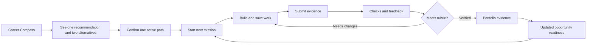

# Design: Lan Pya Career Quest System

Generated by `/office-hours` on 13 August 2026
Branch: `master`
Repo: `SylvesterAshford/lan-pya`
Status: APPROVED
Mode: Startup
Supersedes: `minbhonesan-master-design-20260811-140121.md`

## Problem Statement

Lan Pya currently proves one important idea: a learner can follow a trusted roadmap, complete a real mission, receive transparent review, and control the resulting evidence. But the product still presents this as a software-only system, and its navigation separates `Mission` from `Proof` in a way that makes the core loop harder to understand.

The wider problem is not “Myanmar youth need more software tutorials.” Young people interested in content creation, video editing, visual design, digital marketing, and freelance digital work face the same direction gap: scattered learning, no clear progression, little practical feedback, and no credible way to turn early work into opportunity-ready evidence.

The product must become more engaging without turning career readiness into a game score. Points should motivate action. They must never masquerade as employability or verified competence.

## Demand Evidence

- The team’s Myanmar survey and prior research found strong demand for clear roadmaps, practical tasks, portfolio building, and consolidated opportunities. Learners commonly rely on scattered YouTube content and informal advice.
- UNDP’s nationally representative Myanmar Youth Survey 2024 found one in four youth were not employed, three in four aged 18–24 were no longer in education or training, and nearly half named technical or vocational education as a priority. UNDP recommends flexible learning aligned with jobs in digital sectors.
- The team explicitly wants to expand Lan Pya beyond Frontend, Full-Stack, and AI/Data into content creation, video editing, visual design, and digital marketing.
- TalentOS demonstrates demand for a loop where missions earn points, completed work grows a profile, and bounties connect work to opportunity. Its official current app listing nevertheless advertises only four live AI tracks, showing that broad interest selection and fully operational career tracks are different product layers.

## Status Quo

### Learner workaround

1. Pick a broad interest such as “video editing” or “digital marketing.”
2. Search YouTube, Facebook, Telegram, TikTok, or course platforms.
3. Copy disconnected tutorials without knowing which skills matter first.
4. Produce files or posts without a public brief, rubric, or feedback loop.
5. Build a portfolio manually, often without explaining decisions or outcomes.
6. Find freelance work, internships, or competitions through scattered posts.

### Current Lan Pya experience

- The sidebar numbers sections as if they are a fixed sequence, but the learner actually moves back and forth among work, feedback, evidence, and opportunity.
- `Mission` points directly to one hard-coded Responsive Profile Card page rather than to a mission workspace.
- `Proof` is a separate destination even though proof is the successful output of a mission.
- The Today page explains the evidence loop but does not provide a playful, legible progression system.
- The roadmap supports three software-oriented tracks, while the header and profile remain hard-coded to Frontend Developer.

## Target User & Narrowest Wedge

### Primary user

A Myanmar learner aged roughly 16–28 who wants a first digital career or freelance pathway, learns mainly through free online material, has limited professional experience, and needs one practical next action that can become portfolio evidence.

### Narrowest expansion wedge

Build the reusable Career Quest system and launch **Content Creator & Social Media Storyteller** as the first controlled-pilot non-code path. Keep the three existing software/data paths working through a compatibility layer until their full migration after the hackathon.

Content creation is the best first wedge because it is phone-accessible, naturally portfolio-based, overlaps with video, brand, and marketing, and can produce an inspectable artifact without requiring paid advertising or specialized hardware.

The remaining three digital-career paths launch as clearly labeled **Path Previews** containing the intended outcome, device requirements, representative work, planned stages, and one non-verifiable sampler concept. They are not described as complete curricula and do not create proof until their mission briefs, rubrics, reviewers, and opportunity mappings pass the path readiness gate.

## Constraints

- The hackathon pitch is 20 August 2026. The pitch must show a coherent working system, not pretend that dozens of missions have already been reviewed and calibrated.
- Existing Supabase Auth, Postgres, RLS, mission submission, reviewer workflow, and proof sharing remain the operational foundation.
- Critical flows must work in English and Burmese, on mobile, and under irregular connectivity.
- AI may provide developmental feedback but may not award human-verified evidence by itself.
- Opportunity readiness must derive from supported evidence, not XP, levels, streaks, or popularity.
- New paths require expert-owned competency maps and versioned rubrics. AI-generated curriculum is draft material, not ground truth.
- Media-heavy paths must avoid assuming unlimited upload bandwidth. The first release accepts compressed artifacts or trusted links plus required metadata.

## Research Findings

### What TalentOS gets right

- One obvious next mission with a visible reward.
- A journey surface combining level, points, weekly goals, submission status, and recommended missions.
- Missions that grow a profile instead of disappearing after completion.
- A progression from learning missions to employer bounties and opportunity.

### What Lan Pya should not copy

- A broad interest grid presented as if every interest already has an operational career curriculum.
- Global absolute leaderboards. Research shows they can discourage lower-ranked learners and reduce perceived competence.
- Points for opening the app, scrolling, or maintaining coercive daily streaks.
- AI-generated “verified” labels without a clearly named verification tier.
- Large reward-store promises before reward inventory, eligibility, and sponsor terms are operational.

### Gamification rule from the evidence

A 2024 meta-analysis of 35 gamified learning interventions found a small positive effect on intrinsic motivation and larger effects on autonomy and relatedness, but minimal effect on perceived competence. Performance-linked rewards worked better than participation-only rewards. Public absolute leaderboards, unclear game rules, unsuitable difficulty, and insufficient learner choice were recurring failure modes.

Therefore Lan Pya gamifies **meaningful progress**, not attendance.

## Premises

1. Broad interests and operational career paths are separate objects. An interest may recommend paths and sampler missions; it does not promise a complete curriculum.
2. The scalable product unit is `Path → Stage → Mission → Submission → Review → Portfolio Evidence`.
3. A mission is the work. A submission is the learner’s attempt. Proof is a verified result. These must appear as one continuous lifecycle.
4. XP is motivational metadata. Verified competencies and inspectable artifacts are the career signal.
5. New digital paths must be AI-native and outcome-oriented. A narrow static Graphic Designer curriculum is too exposed to tool disruption; Brand & Visual Content Design includes systems, motion, campaigns, accessibility, AI-assisted workflows, and decision explanation.
6. The app should make exploration safe. Learners may preview any path and, after the pilot, try short sampler missions before changing direction.
7. Each learner has exactly one active path. Other paths remain explorable, and switching preserves all prior progress, submissions, XP, and proof without mixing missions in Build.
8. Opportunities are never hidden behind points or streaks. Readiness explanations may change only when supported evidence changes.

## Approaches Considered

### Approach A: Gamification Overlay

Add XP, levels, weekly goals, and four new path previews to the current information architecture.

- **Effort:** Medium
- **Risk:** Medium
- **Advantage:** Fastest visible change and smallest implementation diff.
- **Failure mode:** Mission and Proof remain conceptually disconnected, navigation remains hard-coded, and every added path multiplies exceptions.

### Approach B: Career Quest System — Selected

Rebuild the product information architecture around Paths, Build, and Portfolio, using one shared mission-to-evidence model across all digital careers.

- **Effort:** Large
- **Risk:** Medium
- **Advantage:** Scalable, legible, and aligned with Lan Pya’s proof-to-opportunity differentiation.
- **Failure mode:** Requires careful migration and disciplined path readiness gates.

### Approach C: Discovery-First Sampler

Make short cross-career sampler missions the main entry experience and delay primary path selection until a learner has tried several kinds of work.

- **Effort:** Large
- **Risk:** Medium–High
- **Advantage:** Strongest response to “I do not know what suits me.”
- **Failure mode:** Requires enough high-quality sampler content across every arena and can delay the deeper proof loop.

## Recommended Approach

Build Approach B and include one bounded feature from C: Career Compass makes exploration safe before commitment. Cross-career sampler missions remain post-pitch work.

### Product promise

> Explore digital careers. Complete real missions. Turn your best work into proof.

### Product model



## Information Architecture

### Primary navigation

1. **Home** — current path, level, next action, submission status, and upcoming opportunity. Weekly goals are a post-pitch module.
2. **Paths** — a personalized career home showing the active path first, two explained alternatives second, and the complete searchable catalog behind `Explore all careers`.
3. **Build** — the active path's next mission, drafts, submissions, feedback, and upcoming stages. It never mixes missions from other paths.
4. **Opportunities** — explained readiness, deadlines, source quality, and saved opportunities.
5. **Portfolio** — verified and in-progress artifacts, competencies, profile presentation, and sharing controls.
6. **Profile** — current path, interests, work preferences, device access, weekly capacity, experience, language, privacy, accessibility, and account controls.

Desktop uses a conventional labeled sidebar without decorative numbering. Mobile root pages use five persistent destinations: Home, Paths, a visually prominent Build action, Opportunities, and Portfolio. Account, language, privacy, and settings live behind the persistent avatar menu instead of consuming a primary mobile destination. Mission detail routes enter Focus Mode: the bottom navigation is replaced by a labelled `Back to Build` control and one sticky state action.

### Why Mission and Proof change

- `Mission` becomes **Build**, a real workspace rather than a link to one mission.
- `Proof` becomes **Portfolio**, the learner-understandable destination for work and evidence.
- Proof creation happens inside the mission lifecycle after review; it is not a separate mental model the learner must discover.

## Interest Arenas

Interest arenas answer “what kind of work sounds interesting?” They may recommend multiple career paths.

| Arena | Example signals | Paths suggested |
|---|---|---|
| Technology & Data | building systems, solving technical problems | Frontend, Full-Stack, AI & Data |
| Stories & Community | explaining ideas, entertaining, teaching | Content Creator, Digital Marketing |
| Visual Craft | composition, style, editing, motion | Video Editor, Brand & Visual Designer, Frontend |
| Business & Growth | audiences, sales, experiments, measurable outcomes | Digital Marketing, Content Creator, AI & Data |
| Freelance & Entrepreneurship | client work, independence, small business | all digital paths plus shared client-work missions |
| Social Impact | education, communities, public-interest problems | Content Creator, Digital Marketing, Data |

Selecting an arena never automatically assigns a career. The learner sees two or three suggested paths, why each matches, typical work, device requirements, time-to-first-proof, and a sampler mission.

## Active Path and Career Discovery

Paths is a personalized career home, not a catalog wall.

Career Compass is a five-step, save-as-you-go flow. Each step has one job, four to six scannable choices, a visible Back action, progress such as `2 of 5`, and `Not sure yet` as a valid answer.

1. **Interests:** choose up to three topics or kinds of problems that feel interesting.
2. **Preferred work:** choose how the learner likes to contribute: make, explain, design, analyze, organize, or grow.
3. **Access:** phone, shared or personal laptop, connectivity constraints, and tools already available.
4. **Capacity and outcome:** weekly time plus the immediate goal, such as explore, freelance, internship, portfolio, or first job.
5. **Prior experience:** broad, path-neutral activities the learner could explain or demonstrate today; a later practical placement check outranks self-report.

Answers save after every step and survive refresh or connection loss. The result screen shows one recommended path, two alternatives, and plain-language reasons tied to the answers. It names uncertainty when answers are incomplete and never uses a fake compatibility percentage. The learner confirms a path before entering the main app and can retake Career Compass from Profile.

1. **Your path:** the active path, current stage, progress, next mission, and one `Continue building` action.
2. **Why it fits:** a short explanation grounded in the learner's saved interests, preferred work, device access, weekly capacity, and demonstrated or self-reported experience. It never uses a fake match percentage.
3. **Recommended alternatives:** at most two compact rows, each with a specific reason, first proof, device requirement, and readiness status.
4. **Explore all careers:** a secondary searchable destination grouped by Technology & Data, Stories & Community, Visual Craft, and Business & Growth. The full catalog is not rendered as an equal card grid on the personalized page.

Exactly one path is active at a time. `Change path` opens a preview and confirmation step that explains the new next mission and states that previous progress will be preserved. Confirming the change updates the active path and all primary surfaces together: Home, Paths, Build, Roadmap, Opportunities, and Profile. Preview-only paths may be explored but cannot become active until they have at least controlled-pilot mission availability.

Switching never deletes or blocks unfinished work. Drafts remain saved under the previous path with a `Paused` label, submitted work continues through review, requested revisions remain actionable from Portfolio, and verified results remain part of the learner's evidence history. Build shows only the newly active path. Profile includes `Previous paths and paused work`, where the learner can inspect old progress or make that path active again.

## Profile Experience

Profile is the learner's private career identity and personalization surface. It does not duplicate Portfolio or pretend to be a public résumé.

1. **Career profile:** active path, current stage, immediate outcome, compact progress, and `Change path`.
2. **Personalization:** interests, preferred work, device/connectivity access, weekly capacity, immediate goal, prior experience, and `Retake Career Compass`.
3. **Previous paths and paused work:** prior progress, saved drafts, reviews still in progress, requested revisions, and a clear `Make active again` action.
4. **Account and language:** one-language selector, privacy, accessibility preferences, account email, and sign-out in a compact settings group below the career content.

Verified work, sharing controls, reviewer details, and employer-facing presentation remain in Portfolio. Profile may show a small link such as `View 3 portfolio items`; it does not render project cards or a public-profile preview.

## Career Path Portfolio

### Existing paths

- Frontend Developer
- Full-Stack Developer
- AI & Data Analyst

### Digital-career expansion

#### 1. Content Creator & Social Media Storyteller

1. Creator orientation and safe publishing
2. Audience and problem research
3. Story structure, scripting, and copy
4. Smartphone production fundamentals
5. Platform-native formats and accessibility
6. Content systems and publishing workflow
7. Analytics, feedback, and iteration
8. Collaboration, briefs, rights, and brand work
9. Capstone campaign and portfolio case study

First verified mission: **Three-piece awareness campaign**. The learner submits an audience brief, three connected assets, captions/scripts, publishing or preview links, accessibility checks, AI-use disclosure, and a reflection on decisions.

#### 2. Video Editor & Motion Content

1. Editing workflow, files, codecs, and backups
2. Cuts, continuity, timing, and pacing
3. Story construction from raw footage
4. Dialogue, music, sound, and licensing
5. Color correction and visual consistency
6. Titles, captions, and accessible delivery
7. Motion graphics and compositing foundations
8. Platform exports, client notes, and revisions
9. Capstone short-form story and case study

First verified mission: **Thirty-second vertical story edit** using supplied or self-shot footage, with captions, licensed audio, platform exports, and a revision response.

#### 3. Brand & Visual Content Designer

1. Design principles and visual problem framing
2. Typography and information hierarchy
3. Color, imagery, composition, and accessibility
4. Layout systems and multi-format adaptation
5. Tool fluency and file organization
6. Brand identity foundations
7. Social and campaign design systems
8. Client briefs, critique, iteration, and delivery
9. Capstone launch kit and portfolio case study

First verified mission: **Mini campaign identity kit** with a brief, moodboard, type/color system, five responsive assets, accessibility notes, source files, and decision rationale.

#### 4. Digital Marketing & Growth

1. Customer, market, and ethical research
2. Goals, funnels, positioning, and measurement
3. Channel and content strategy
4. Copywriting and creative briefs
5. Organic social and community systems
6. Search and discoverability foundations
7. Paid campaign concepts and budget reasoning
8. Analytics, experiments, and reporting
9. Email, lifecycle, and retention fundamentals
10. Capstone growth campaign and case study

First verified mission: **No-spend campaign plan** containing customer research, a channel hypothesis, creative assets, a landing-page concept, measurement plan, and ethical risk review. It avoids requiring learners to purchase ads.

### Path readiness gate

A path has one of three product statuses:

- **Preview:** planned outcomes and stages are visible, but no verified mission is available.
- **Controlled Pilot:** at least one mission is available to a named cohort under declared review limits; the path does not claim a complete curriculum or production review capacity.
- **Operational:** the entire readiness gate below has passed and the product has sustainable review capacity.

A path may be labeled **Operational** only when it has:

- an expert-owned competency map and prerequisite graph;
- complete bilingual stage descriptions;
- at least one versioned operational mission;
- a published rubric and allowed evidence types;
- named reviewers trained on calibration examples;
- an appeal and revision process;
- at least three current opportunities or realistic role outcomes mapped to competencies;
- accessibility, bandwidth, device, copyright, and AI-use guidance.

If the Operational gate has not passed, the path remains **Controlled Pilot** when a controlled-pilot mission is available; otherwise it is **Preview**. In both cases the UI plainly explains what remains unavailable.

## Mission Experience

### Build hub

The Build page prioritizes three things from the active path only:

1. Resume the active mission or act on review feedback.
2. Understand current submission status.
3. See the next one or two missions in sequence without browsing unrelated careers.

Cross-career browsing belongs in Paths. Build may filter the active path by mission state after more than five missions are available, but it never uses a Path filter.

Each mission card shows:

- mission outcome;
- associated path and stage;
- difficulty and time estimate;
- device or software requirements;
- XP available;
- evidence produced;
- status and one explicit next action.

### Mission detail hierarchy

1. **Outcome:** what the learner will make and why it matters.
2. **Reward summary:** XP, competencies practiced, and possible evidence tier.
3. **Brief:** context, audience, constraints, and supplied assets.
4. **Steps:** a short checklist with draft persistence.
5. **Examples and resources:** curated references, never a content dump.
6. **Rubric:** visible before the learner starts.
7. **Submission:** artifact links/files, explanation, AI-use disclosure, and consent.

Mobile mission detail uses Focus Mode. The normal bottom navigation is hidden only after entering a mission, a labelled `Back to Build` control remains at the top, and one sticky bottom action changes with state: `Start mission`, `Continue`, `Submit`, `View feedback`, or `Add to portfolio`. Exiting restores the root Build page and bottom navigation.

### Mission lifecycle

| State | What the learner sees | Primary action |
|---|---|---|
| Available | outcome, requirements, XP, proof target | Start mission |
| In progress | checklist, saved draft, progress | Continue building |
| Ready to submit | rubric self-check and evidence form | Submit for review |
| Automated checks | named checks and expected wait | Keep working or leave safely |
| Human review | reviewer tier, queue status, expected wait | View submission |
| Needs changes | criterion-level feedback and retained draft | Revise submission |
| Not verified | final criterion or policy reason, scope of the decision, and appeal eligibility | View decision or appeal |
| Verified | earned competencies and evidence summary | Add to portfolio |
| Revoked or expired | reason, effect, and appeal path | Resolve issue |

## Portfolio and Proof

Portfolio is the learner-facing container. It holds:

- work in progress the learner chooses to display privately;
- submitted artifacts awaiting review;
- verified evidence records;
- revoked or superseded evidence with clear history;
- competencies supported by each artifact;
- share-link controls and preview of exactly what recipients see.

A verified proof record always names the mission version, rubric version, immutable submission snapshot, criterion results, reviewer tier, verification date, AI-use disclosure, and revocation state. For externally hosted media, Lan Pya records the exact URL, declared file metadata, reviewer-access time, reviewer-captured preview when permitted, and a visible `Verified at this URL on [date]` limitation. It does not claim to preserve an immutable copy of the externally hosted original in P0.

Employers and opportunity matching never use XP as evidence.

### Verification tiers

| Tier | Meaning | Awarded by | Career use |
|---|---|---|---|
| Completed | The learner met low-stakes completion criteria; no claim of independent quality review | deterministic completion rule or track operator | motivation and path progress only |
| Human Reviewed | A trained Lan Pya reviewer applied the published rubric to the submitted artifact | active reviewer with recorded rubric decision | verified competencies and portfolio proof |
| Partner Verified | A calibrated external expert or employer reviewer applied the same rubric and disclosed affiliation/conflict state | approved partner reviewer | verified competencies plus named partner context |

`Completed` work may appear in the learner’s private portfolio as work in progress, but it never creates a verified competency, employer-facing proof claim, or opportunity-readiness change. The UI always spells out the tier rather than using one undifferentiated checkmark.

## Progress and Gamification System

### Three distinct progress signals

1. **Path XP:** visible motivational feedback for meaningful work and improvement.
2. **Path level:** a learner-friendly summary gated by completed missions and verified milestones.
3. **Verified competencies:** the only signal used for opportunity readiness.

XP and levels are scoped to one career path. The active path shows its own XP and level; Profile preserves the same summary for previous paths. Switching paths never transfers XP into another career. Verified competencies and Portfolio evidence remain portable and may support multiple paths or opportunities when their underlying rubric evidence is relevant.

### XP rules

- Award XP for rubric-linked mission completion, meaningful revision, calibrated peer contribution, or verified capstone work.
- Do not award XP for login, scrolling, opening resources, profile views, or raw time spent.
- Do not sell XP or allow sponsors to inflate it.
- Display the rule before the action and record an XP ledger entry afterward.
- Cap repeatable rewards and detect duplicate submissions.
- Corrections or revocations may remove the associated XP with an audit explanation.

Initial weighting:

| Action | XP | Rule |
|---|---:|---|
| Complete a sampler mission | 25 | Meets published completion criteria |
| Complete a foundation mission | 60 | Human review optional only when no proof is claimed |
| Earn verified core mission proof | 100 | Human-reviewed rubric decision |
| Complete a meaningful requested revision | 20 | Award once per review cycle, not per resubmit click |
| Earn verified capstone proof | 250 | Calibrated human review required |
| Complete an optional weekly goal | 10 | Capped once weekly; never affects readiness |

### Levels

- Level 1: Explorer
- Level 2: Starter
- Level 3: Maker
- Level 4: Practitioner
- Level 5: Trailblazer

The interface explains the exact requirement for the next level. Higher levels require both XP and specified mission evidence, preventing activity farming. Level names communicate progress inside Lan Pya; none claim employability or opportunity readiness.

| Level | XP minimum | Evidence gate |
|---|---:|---|
| Explorer | 0 | Account and path exploration complete |
| Starter | 100 | At least one Completed mission |
| Maker | 300 | At least one Human Reviewed core mission |
| Practitioner | 700 | At least three Human Reviewed core missions spanning two path stages |
| Trailblazer | 1,200 | One Partner Verified or Human Reviewed capstone plus four other Human Reviewed core missions |

Level calculation is deterministic within each path and reruns whenever that path's XP ledger entry or qualifying proof changes. Revoked evidence no longer satisfies its evidence gate; associated XP is removed only when the revocation invalidates the underlying completion rather than merely disabling public sharing. Opportunity readiness remains a separate evidence computation.

### Weekly goals

Learners choose a goal such as:

- Finish one mission step.
- Submit one artifact.
- Respond to feedback.
- Practice for two focused sessions.

Goals support autonomy. Missing a goal never resets career progress. Streaks use a weekly rhythm and a grace week rather than daily pressure.

### Social progression

- No global absolute leaderboard at launch.
- Optional cohort challenges compare completion against a shared target, not rank every learner from best to worst.
- Community recognition highlights useful work, improvement, collaboration, and thoughtful feedback.
- Public profiles may show levels and badges only alongside inspectable artifacts and verification labels.

## Home Experience

The first viewport answers:

1. Where am I?
2. What should I do next?
3. What changed because of my last action?

Recommended hierarchy:

1. Path identity, level, and XP to next level. A weekly-goal module may be added after the pitch.
2. One primary quest card with a clear next action.
3. Submission or reviewer feedback status.
4. Roadmap progress and recently earned evidence.
5. One explained opportunity or sampler recommendation.

Points and levels provide energy but never overpower the work itself.

## Opportunity Connection

Each opportunity shows:

- evidence-supported requirements;
- gaps the learner can address through named missions;
- unknown criteria Lan Pya cannot determine;
- source, deadline, location, compensation when available, and last verification date;
- whether it is open to sampler, beginner, or portfolio-ready learners.

Points do not unlock opportunities. An opportunity may suggest `Build this mission` when a specific evidence gap exists.

## Operational Roles

| Role | Responsibility |
|---|---|
| Learner | Explore paths, complete missions, submit work, manage portfolio and sharing |
| Track expert | Own competency map, stage sequence, mission briefs, and rubric truth |
| Reviewer | Apply rubric, declare conflicts, give criterion-level feedback |
| Reviewer lead | Calibrate reviewers, audit decisions, resolve appeals |
| Content operator | Publish versions, translations, assets, and availability labels |
| Opportunity operator | Verify listings and maintain competency mappings |
| Sponsor | Fund cohorts or declared rewards without altering verification or readiness |

## Hackathon Release Scope

### Must work by 20 August

- Revised navigation and understandable Build/Portfolio lifecycle.
- A five-step, save-as-you-go Career Compass that asks interests, preferred work, device access, weekly capacity/outcome, and prior experience; recommends one primary path plus two alternatives; and lets the learner confirm one active path.
- A path-switching flow for operational and controlled-pilot paths that preserves prior progress and updates Home, Paths, Build, Roadmap, Opportunities, and Profile together.
- One Content Creator path with one end-to-end mission: start, locally persisted draft, trusted-link submission, controlled pilot review, revision, and verified portfolio evidence.
- XP ledger and deterministic level display for the Content Creator journey.
- Existing technical paths use a P0 compatibility adapter: Home and Paths link to their current roadmaps, Build resumes the current technical mission/task, and Portfolio reads existing proof records. Quest XP and levels remain hidden for technical paths until their P1 migration.
- Video Editor, Brand & Visual Content Designer, and Digital Marketing appear only as explicitly seeded Path Previews.
- Seeded demo states demonstrate later lifecycle states without representing seeded records as live verification.
- Weekly goals, sampler missions, advanced mission filters, cohort challenges, and simultaneous multi-path progression are intentionally deferred.

### After the pitch

- Add weekly goals, sampler missions, and active-path mission filters after the core lifecycle passes comprehension testing.
- Migrate the three technical paths into the same shared path, mission, and XP model.
- Complete operational mission libraries for Video Editor, Brand & Visual Content Designer, and Digital Marketing & Growth.
- Calibrate reviewers and build examples at fail, revise, and pass levels.
- Add cohort challenges and sponsor-funded rewards only after governance and inventory exist.
- Add group missions after individual lifecycle comprehension is validated.

## Success Criteria

### Comprehension

- In usability testing, at least 4 of 5 first-time learners can explain the difference between mission, submission, feedback, portfolio, and verified proof without coaching.
- At least 4 of 5 can locate their next action within ten seconds on Home and Build.
- No tested learner interprets XP as an employer verification score after reading the progress explanation.

### Activation

- Pilot measurement uses 30–50 invited Myanmar learners over a 30-day observation window. Staff, seeded-demo accounts, reviewers, duplicate test accounts, and users who never accept the pilot consent are excluded.
- At least 60% of eligible pilot learners complete Career Compass, inspect the Content Creator recommendation, confirm an active path, and start its mission in the first session.
- At least 40% save a meaningful first draft or artifact within seven days of first sign-in.

### Evidence loop

- At least 30% of activated pilot users submit the mission within 30 days.
- At least 60% of learners receiving `Needs changes` return to revise.
- Median reviewer turnaround stays below 72 hours during the pilot.
- Verified Evidence Rate remains the north-star outcome.

### Engagement guardrails

- Track weekly return and mission progression, not raw session time.
- Monitor XP farming, duplicate submissions, low-value repeat actions, and dropout after feedback.
- After weekly goals ship, compare progress among users who choose them and those who do not; do not assume the goal caused retention.

## NOT in Scope

- Fifteen or more fully operational career tracks at launch.
- Global leaderboards or public rank numbers.
- AI-only high-stakes verification.
- Points-based opportunity gates.
- Paid advertising spend as a learner requirement.
- A reward store before supply, eligibility, fulfillment, and sponsor terms are operational.
- Group clans, chat, and social feed in the hackathon release.
- Weekly goals, sampler missions, simultaneous multi-path progression, advanced filtering, and complete migration of all technical paths before the hackathon.
- Trade, agriculture, healthcare, or migration pathways requiring a different evidence and duty-of-care model.

## What Already Exists

- Supabase authentication, Postgres, RLS, queueing, reviewer roles, mission submission, proof creation, and revocable sharing.
- Three complete technical roadmap structures in `lib/domain/career-tracks.ts` and `supabase/seed.sql`.
- A responsive roadmap tree already redesigned using roadmap.sh interaction principles.
- A real mission brief, submission form, deterministic evaluation pipeline, human review flow, and proof viewer.
- The approved Deep Navy, Teal, Warm Yellow, Soft White design system and Plus Jakarta Sans/Padauk typography.

## Open Questions

- Who serves as track expert and reviewer lead for each new digital path.
- Which real opportunities or sponsor programs can validate the first new-path competency maps.
- Whether XP is named `XP`, `Path Points`, or a culturally adapted Burmese term after learner testing.

## Operational Definitions

- **Meaningful revision:** a new submission version that addresses at least one reviewer-marked rubric criterion and includes a short change note. Revision XP is awarded once per review cycle.
- **Calibrated reviewer contribution:** a review completed by an active reviewer whose agreement rate on the current rubric calibration set meets the reviewer-lead threshold. Peer contribution is not rewarded in P0.
- **Current opportunity:** a listing whose source was checked within the configured freshness window, whose deadline has not passed, and whose operator status is `published`.
- **Realistic role outcome:** a role, freelance service, or client deliverable supported by at least two current source briefs or one named partner brief and reviewed by the track expert.
- **Activated learner:** an eligible pilot learner who starts the operational Content Creator mission.
- **Verified evidence:** a proof record at Human Reviewed or Partner Verified tier; `Completed` work is excluded.

## Content Creator P0 Rubric Boundary

The first mission, **Three-piece awareness campaign**, requires:

- one audience/problem brief in text or PDF form;
- three connected assets supplied through reviewer-accessible HTTPS links;
- the scripts, captions, or copy used in those assets;
- an asset/source list covering music, images, footage, and permissions;
- accessibility notes covering captions, contrast, and readable text where applicable;
- an AI-use disclosure and 150–300 word decision reflection.

Minimum rubric dimensions:

| Criterion | Weight | Required pass condition |
|---|---:|---|
| Audience and problem framing | 20% | Defines one audience, one intended response, and evidence for the framing |
| Coherent story across three assets | 25% | Assets have a connected message and deliberate sequence |
| Platform fit and technical execution | 20% | Formats work at the stated dimensions and are understandable on mobile |
| Accessibility, rights, and safe publishing | 15% | Required captions/contrast are present and sources/permissions are disclosed |
| Process, iteration, and AI disclosure | 20% | Reflection explains decisions, any feedback changes when feedback was received, and any AI assistance |

Every required criterion must pass; the weighted total supports feedback but cannot hide a failed required criterion.

## P0 Media Submission Decision

The hackathon release accepts reviewer-accessible HTTPS artifact links plus required metadata. It does not accept direct video uploads. Supported examples include an unlisted video link, a public view-only design link, or a public cloud-file link that opens without a reviewer login. Automated evaluation never fetches an unapproved host; unsupported or inaccessible links become `Inconclusive` and route to a learner correction state rather than failing the work.

At submission, Lan Pya freezes the learner's text, link list, declared filenames, sizes, media types, and source/rights metadata as the immutable submission snapshot. At review, it records access time, final URL, reviewer-visible title/metadata, and a preview image only when capture is permitted. The proof says `Verified at this URL on [date]`; later link changes or loss trigger recheck or expiration rather than silently preserving the original claim. Full media archival is a post-pitch storage, copyright, consent, and retention decision.

## Operational Edge Cases

| Situation | State/result | Learner experience | Owner |
|---|---|---|---|
| Connectivity drops during drafting | remains In progress | local draft remains available and sync retries safely | product system |
| Submission request times out | no duplicate attempt unless server confirms creation | clear retry action and existing submission ID when created | product system |
| Duplicate submit click | one idempotent submission version | button locks and status confirms one attempt | product system |
| Learner edits after submission | creates a new draft; submitted snapshot stays immutable | explanation that review covers the submitted version | learner/product system |
| Artifact link is inaccessible | Inconclusive | exact failing link and correction action, no automatic rejection | learner |
| Reviewer misses 72-hour target | Review delayed | updated queue message and escalation notice | reviewer lead |
| Reviewer declares conflict | reassigned without rubric decision | neutral delay message; conflict reason remains private | reviewer lead |
| Reviewer requests changes | Needs changes | criterion-level feedback, retained draft, and resubmit action | reviewer/learner |
| Learner appeals an eligible Not verified, Verified, expired, or revoked decision | Under appeal | proof state is frozen; appeal status and expected response are visible | reviewer lead |
| Appeal upheld | prior decision remains | rationale added to audit history | reviewer lead |
| Appeal changes decision | new decision supersedes old one | portfolio/readiness/XP recalculate with visible explanation | reviewer lead/product system |
| Proof sharing is revoked | proof remains private and verified unless underlying evidence is invalid | public links stop working; private history remains | learner |
| Learner switches paths with a local or server draft | draft becomes Paused and XP/level remain attached to the previous path | Build opens the new path; Profile lists the paused draft and previous progress | learner/product system |
| Learner switches while a submission is in review | review continues against the immutable submitted version | Portfolio retains the review status; Build does not mix it into the new path | reviewer/product system |
| Learner switches while changes are requested | revision remains available under Portfolio and the previous path history | a non-blocking reminder explains that completing the revision can still create evidence | learner |
| Active controlled pilot closes | path remains in history but cannot accept new starts | explain closure, preserve all work, and recommend the nearest eligible path without auto-switching | product/track owner |

## Pilot Ownership and Capacity Gate

Before the Content Creator mission may accept controlled-pilot submissions, the team must record named people for Product Owner, Content Track Expert, Reviewer Lead, Burmese Language Owner, and Support Owner. The Reviewer Lead must publish a 72-hour target, a backup reviewer, a conflict process, and at least three calibration examples: fail, needs changes, and pass.

The Content Creator path remains labeled **Controlled Pilot** until both this capacity gate and the full path readiness gate pass. If any named owner or calibrated reviewer is missing on 19 August, live submission is closed and only clearly seeded lifecycle states may support the pitch. A mission separately displays its review availability as `Seeded demo`, `Closed`, `Controlled pilot`, or `Live`; mission availability never upgrades the parent path status by itself.

## Delivery Sequence and Acceptance Map

| Slice | Deliverable | Acceptance check | Rollback boundary |
|---|---|---|---|
| 1. Navigation and IA | Home, Paths, Build, Opportunities, Portfolio; settings behind avatar; five-step Career Compass; one active path | first-time tester finds Build and Portfolio in under 10 seconds, understands which path is active, and sees only that path's missions; English/Burmese labels fit at 320px | restore prior shell routes without changing stored evidence or previous-path progress |
| 2. Shared quest model | Content path, stage, mission, status, XP ledger, verification tier; technical-path compatibility adapter | seeded and live records render with explicit provenance; tier never inferred from XP; technical users can resume existing roadmap, mission, and proof flows | feature flag new quest reads while preserving current roadmap tables and shell |
| 3. Content mission | bilingual brief, rubric, offline draft, trusted-link evidence form | refresh/offline recovery retains draft; invalid link produces correction state; Burmese rubric is meaning-equivalent and mobile overflow passes at 320px | disable mission availability without deleting drafts |
| 4. Review and proof | immutable submission snapshot, reviewer decision, revision, proof creation | end-to-end test covers submit → needs changes → resubmit → verified → revoked share | retain existing proof API and disable Content mission review route |
| 5. Progress | XP ledger, deterministic levels, audit explanation | repeated requests are idempotent; revocation recalculates level correctly | hide XP/level presentation while retaining ledger rows |
| 6. Demo states | clearly seeded previews and lifecycle examples | no seeded record appears in live verification metrics or unlabeled UI | remove seed fixtures without affecting live accounts |

## Distribution Plan

Lan Pya remains a responsive PWA deployed on Vercel with Supabase as the operational backend. Production deploys continue through the existing repository and Vercel pipeline. The seeded account remains a clearly labeled demonstration mode within the same product.

## Design Review Addendum

### Design position

Lan Pya is a focused career workspace, not a generic dashboard and not a game arcade. Its visual anchor is the directional line from the Lan Pya mark: a calm, purposeful path that connects the learner’s next action to evidence. XP gives a small spark of momentum; the work, rubric, and proof remain visually dominant.

The core composition is the **Path Spine**. A thin directional route connects the learner's active stage, next mission, submission/review state, and resulting proof. It is a structural wayfinding device, not decorative artwork. Paths uses one dominant active-path workspace plus compact recommendation rows. Build uses the same spine as a progress rail beside one mission workspace. Portfolio closes the route with evidence and verification state. Equal card mosaics, unrelated mission libraries, and dashboard widget walls are prohibited.

Use the approved system in `DESIGN.md`: Soft White canvas, a Deep Navy navigation rail, Teal for active learning and progress, and one Warm Yellow primary action per viewport. Plus Jakarta Sans is the Latin UI face and Padauk is the Burmese face. Use real, consistent icons rather than emoji.

### Navigation and screen hierarchy

Desktop navigation uses a labelled, unnumbered rail in this order: **Home**, **Paths**, **Build**, **Opportunities**, **Portfolio**. The current destination has a Teal-tint background and a 4px Teal leading indicator. Profile, language, privacy, accessibility, and sign-out sit in the avatar menu; they do not compete with learning destinations.

Mobile uses a fixed five-item bottom bar in the same order. `Build` is the centre action, visually raised only enough to signal the primary workspace; it is still a standard 48px labelled button with an icon, not a floating novelty control. No emoji appear in production navigation. At any time the learner sees one language only; the selected language changes in Profile and never creates bilingual duplicate labels.

| Screen | First thing the learner sees | Second | Third | Primary action |
|---|---|---|---|---|
| Home | current path, compact level/XP, and review availability | one large “next quest” row with status | recent proof or one explained opportunity | context-specific: Start, Continue, Revise, or View feedback |
| Paths | the active path, progress, and next mission | two compact recommendations with a plain “why this fits” reason | `Explore all careers` search and grouped catalog | Continue building or Change path |
| Build | the active path's next mission, outcome, and current state | step list or feedback summary | the next one or two stages plus collapsible rubric/evidence requirements | Start, Continue, Submit, or Revise |
| Opportunities | one relevant opportunity with evidence-gap explanation | saved/current listings in dense rows | source and freshness metadata | Build the missing evidence |
| Portfolio | verified evidence summary and private/public control | evidence entries grouped by verification state | competencies and share preview | View, share, or manage proof |
| Profile | active path and current career identity | saved personalization and Career Compass controls | previous paths plus compact account/language settings | Change path or Edit career profile |

The desktop Home layout is one primary workspace column plus a narrow status rail, never a mosaic of equal-sized statistic cards. The mobile Home order is: current path → next quest → review status → recent proof → opportunity. A learner should not need to scroll past a scorecard before discovering what to do.

### Page structures

```
HOME
  path context / level / XP to next level
  └─ next quest (one dominant action)
  review or submission status
  recent evidence
  explained opportunity

CAREER COMPASS
  1 of 5: interests
  2 of 5: preferred work
  3 of 5: device and connectivity access
  4 of 5: weekly capacity and immediate outcome
  5 of 5: prior experience
  └─ result: one recommendation + two alternatives + why each fits
      └─ confirm one active path

PATHS
  path spine: active path / current stage / next mission / proof target
  why this fits
  two recommended alternatives
  └─ explore all careers: search + grouped catalog
      └─ preview → confirm change → preserve previous progress

BUILD
  active-path spine + mission header + state
  ├─ brief and steps
  ├─ rubric self-check
  ├─ evidence form / reviewer feedback
  └─ next one or two active-path missions

PORTFOLIO
  verification filter + sharing control
  ├─ verified evidence
  ├─ awaiting review / needs changes
  └─ private work in progress

PROFILE
  active path / current stage / change path
  career preferences / retake Career Compass
  previous paths / paused work / continuing reviews
  account / language / privacy / accessibility / sign-out
```

Path and mission selection use a structured list or a roadmap node; cards are reserved for an item that can genuinely be opened, selected, or acted on. A Path Preview never presents a yellow “Start” action: it uses `See planned path` and plainly explains that verified missions are not yet available. A Controlled Pilot path always carries a text label next to its status icon; its availability must never be inferred from its colour.

### Mission and proof interaction specification

The Build page has one stable frame. Only the action, supporting panel, and status change as a learner progresses:

| Mission state | Main visual treatment | Fixed bottom action on mobile | Status copy |
|---|---|---|---|
| Available | outcome, time/device requirements, visible rubric | Start mission | `About 60–90 minutes · creates portfolio evidence` |
| In progress | numbered step list and local-save indicator | Continue building | `Saved on this device` or `Saving…` |
| Ready to submit | completed self-check and evidence fields | Submit for review | `You can still edit this draft after submitting` |
| Automated checks | compact non-blocking progress row | Keep working | `Checking your links — this will not change your draft` |
| Human review | submission snapshot and expected response window | View submission | `In review · target response within 72 hours` |
| Needs changes | criterion-level feedback, each linked to the relevant form/step | Revise submission | `Your first version is saved. Fix these items when ready.` |
| Not verified | clear decision reason, rubric evidence, appeal eligibility | View decision | `This is not portfolio proof yet.` |
| Verified | proof record, competencies, and verification tier | View portfolio | `Human Reviewed · verified on [date]` |

Portfolio separates **Verified evidence**, **In review**, **Needs changes**, and **Private work** as filters or grouped sections, rather than making the learner decode a single mixed feed. Evidence rows lead with the artifact title and verification tier; the reviewer, date, rubric version, and external-link limitation appear directly below. Sharing defaults to private. Turning sharing on requires a preview of the exact recipient-facing page and a `Copy share link` confirmation.

### Interaction state coverage

| Feature | Loading | Empty / first use | Error | Success | Partial / constrained |
|---|---|---|---|---|---|
| Home | preserve the shell and show a single next-quest skeleton | “Your first path starts with one small choice” plus `Explore paths` | `We could not refresh your progress` plus Retry and last-known state | next quest updates in place with a short confirmation | show last synced time when data is stale |
| Career Compass | keep completed answers visible and skeleton only the recommendation result | every question includes `Not sure yet`; an incomplete profile can still receive broad recommendations | save failure retains every answer locally and offers Retry | show one recommended path, two alternatives, and the specific reasons before confirmation | unavailable or low-confidence recommendations explain which answer would improve them; never invent a match score |
| Paths | preserve the active-path summary and skeleton only the recommendations | no active path opens Career Compass with `Find my path`; no alternatives explains how to edit preferences | retry recommendations without losing the active path or saved preferences | changing paths updates every primary surface and confirms preserved progress | preview paths remain searchable but cannot become active until mission availability opens |
| Path switching | retain the current path until confirmation completes | no eligible alternative links to `Explore all careers` without changing state | failed switch leaves the current path active and provides Retry | confirm the new active path, its next mission, and that prior work was preserved | old drafts become Paused, reviews continue, requested revisions remain in Portfolio, and closed pilot paths cannot be activated |
| Build draft | show the mission frame before resources load | no active mission shows one recommended mission and `Explore paths` | field-level validation; failed submit preserves every input | saved timestamp and one concise confirmation | offline draft label, queued submit, inaccessible link = `Needs attention`, not fail |
| Review | show an unobtrusive status row | no submissions explains what evidence becomes after review | delayed review shows target missed and support route | verified state links straight to portfolio | reviewer conflict or appeal has a neutral private status, never a public warning |
| Portfolio | evidence row skeletons preserve grouping | explain private-by-default proof and link to Build | share-link failure leaves proof private and gives Retry | copy confirmation and recipient preview | revoked/expired proof stays in history with a plain reason and appeal link |
| Profile | keep account settings usable while career data loads | missing personalization offers `Complete Career Compass`; no previous paths hides that section | failed preference save retains edits and leaves the active path unchanged | changed preferences refresh recommendations without silently switching paths | paused drafts and continuing reviews are grouped under their previous path; Portfolio remains the owner of evidence |
| Opportunities | dense listing skeletons | one relevant example plus `Explore paths` | retain saved opportunities and show source error separately | save state is immediate and reversible | stale or unknown requirement displays its freshness/unknown label rather than a false readiness score |

### Emotional journey

| Moment | Learner feeling | Design response |
|---|---|---|
| First sign-in | uncertain, possibly behind | five short Career Compass steps with `Not sure yet`, saved progress, one explained recommendation, two alternatives, and no empty dashboard metrics |
| Recommended path | curious but sceptical | show why it fits, device requirement, and the first concrete output before asking for commitment |
| Starting Build | cautious | visible outcome, short time estimate, rubric, and local-save assurance reduce the fear of wasting effort |
| Submitting work | vulnerable | clear snapshot, no hidden scoring language, and an expected review window |
| Needs changes | discouraged | preserve the first attempt, show only actionable criterion feedback, and make the next action one tap away |
| Verified proof | proud but practical | celebrate once, then show the evidence record and what it can support; no confetti or fake employability claim |
| Opportunity gap | motivated | name the missing evidence and link exactly to the mission that addresses it |

At five seconds, the screen must answer “What is my next move?” At five minutes, the learner must understand how work turns into proof. Over time, the portfolio must make the learner feel their effort is accumulating into something inspectable.

### Component grammar and visual rules

- **Path spine:** a 2px Teal route with labelled stage nodes; Warm Yellow marks only the current action and Green marks only completed or verified states. Desktop places it beside or above the workspace; mobile converts it to a compact horizontal stage summary rather than squeezing the full diagram.
- **Quest row:** the primary interactive unit; left-aligned outcome and status, concise metadata, and one right-aligned action. It may use a 2px directional rule tied to the roadmap, not a decorative card grid.
- **Recommendation row:** a compact selectable row with one career-specific line icon, title, first proof, readiness, and one sentence explaining why it fits. Recommendations never become three equal promotional cards.
- **Path status label:** icon + text + plain-language explanation. Use Teal for active learning, Green only for completion/verified evidence, Yellow only for the one current action or deadline.
- **Level/XP:** compact inline status near the current path; never a full-width hero card and never adjacent to opportunity readiness.
- **Cross-path progress:** show only the active path's XP/level in Home, Paths, and Build. Profile may list previous path levels in subdued rows; never combine them into a global career score.
- **Roadmap node:** a central stage node with connected branches for skills/proof targets on desktop; a horizontal stage selector plus an expandable detail panel on mobile.
- **Feedback item:** one rubric criterion, decision, explanation, and `Go to fix` action; do not show an unprioritised wall of reviewer text.
- **Typography:** H1 is 30px mobile / 34px desktop; H2 is 22px mobile / 24px desktop; H3 is 18px; body is 16px; secondary copy is 14px; metadata is 13px; labels are 12px. Burmese uses Padauk with generous line height. Latin labels may be uppercase; Burmese labels never are.
- **Surfaces:** 8px control radius, 10–12px interactive surfaces, 1px cool-slate lines, and only functional shadows. Do not add purple gradients, repeated icon circles, coloured left-border cards, or centred SaaS-style feature grids.
- **Icons and graphics:** use one Lucide-style outlined icon family at 18px, 20px, or 24px with consistent stroke weight. Every career has a specific symbol; generic `+` and `↗` glyphs are not career identities. Custom spot graphics are reserved for the Career Compass result and meaningful empty states, never repeated on every row.
- **Motion:** only 160–240ms state transitions for saving, status change, expanding roadmap detail, and copy confirmation. Respect `prefers-reduced-motion`; no streak fire, confetti, or bounce reward animation.

### Responsive and accessibility requirements

| Viewport | Intentional layout |
|---|---|
| 1280px+ | 232–256px rail; 12-column content grid; Home status rail and Build rubric panel may remain visible beside the primary work area |
| 768–1279px | compact rail or labelled drawer; 8-column grid; status rail moves beneath the primary action, not above it |
| 360–767px | 16px gutters; fixed five-item bottom navigation on root pages; mission detail Focus Mode replaces it with Back-to-Build plus one sticky action above the safe area; one-column mission flow; roadmap uses detail-on-select rather than a squeezed tree |

- All interactive controls have a 44px minimum target, visible focus treatment, and a label that remains visible after content is entered.
- Navigation uses semantic `nav` landmarks; Build uses one H1 followed by ordered H2 sections; status messages use a polite live region only when the status actually changes.
- Every state has text in addition to colour and icon. Body text meets 4.5:1 contrast; verification and error text are not reduced below 16px.
- Tab order matches visual order; desktop sidebar, avatar menu, roadmap nodes, Build steps, and share controls must be keyboard operable. Escape closes menus/drawers and returns focus to their trigger.
- Entering mobile Mission Focus Mode moves focus to the mission H1. Back restores focus to the mission row that launched the workspace. The sticky action appears once in the accessibility tree and never duplicates an equivalent inline control.
- English and Burmese are tested independently at 320px, 360px, and 200% zoom. Strings may wrap; navigation labels and actions may not truncate into ambiguity.

### Visual work explicitly deferred

- Weekly-goal and cohort-challenge surfaces remain out of the P0 interface to protect the next-quest hierarchy.
- Reward-store, public leaderboard, social feed, and badge-collection visuals are not designed for the hackathon because they would compete with proof.
- Direct media-upload preview and archival UI waits for the consent, copyright, storage, and retention decision.
- The three preview paths receive only an honest detail screen; no fake progress, proof, or active mission states are designed before their operational gates pass.

### Design acceptance checks

1. On a 360px English or Burmese screen, a first-time learner can find Home, Paths, Build, Opportunities, Portfolio, and the language setting without help.
2. From Home, a learner can reach an actionable Build state in one tap/click and can state what artefact they will make before starting.
3. A learner can distinguish `Completed`, `Human Reviewed`, and `Partner Verified` without relying on colour or reading a help article.
4. A learner receiving feedback can find the affected criterion and resume the relevant step without copying information between pages.
5. No screen has more than one Warm Yellow action, no primary page begins as an equal-card dashboard, and no production navigation uses emoji.

## Implementation Tasks

Synthesized from this design review. Each task is a build action, not a visual polish suggestion.

- [ ] **T1 (P1, human: ~10h / CC: ~90min)** — Personalization model — persist Career Compass answers, exactly one active path, previous-path history, paused work, and path-scoped XP/levels.
  - Surfaced by: Information Architecture and Unresolved Decisions — the current profile has no active-path or preference model and the XP total is global.
  - Files: `supabase/migrations/`, `lib/domain/types.ts`, `lib/data/app-data.ts`, `app/api/profile/route.ts`.
  - Verify: path switching is atomic, prior progress survives, reviews continue, Content Creator XP never changes Frontend level, and RLS prevents cross-user access.
- [ ] **T2 (P1, human: ~12h / CC: ~2h)** — Career Compass — replace the frontend-only placement form with five save-as-you-go steps and an explained one-plus-two recommendation result.
  - Surfaced by: User Journey — the current assessment feels like a technical exam before the learner understands available careers.
  - Files: `components/onboarding/onboarding-form.tsx`, onboarding route, profile/recommendation API, offline draft storage, i18n messages.
  - Verify: Back, refresh, offline recovery, `Not sure yet`, partial answers, save failure, retry, confirmation, English, and Burmese all preserve valid state.
- [ ] **T3 (P1, human: ~10h / CC: ~90min)** — Personalized Paths — show the active path first, two explained alternatives second, and move the complete grouped catalog behind search and progressive disclosure.
  - Surfaced by: Information Architecture — the current equal card wall gives every career the same weight and does not identify the learner's direction.
  - Files: `app/[locale]/app/paths/page.tsx`, career recommendation/domain data, path-switch API/components.
  - Verify: no more than two alternatives appear by default; preview paths cannot become active; a failed switch leaves the old path active; all primary surfaces update after success.
- [ ] **T4 (P1, human: ~8h / CC: ~75min)** — Path Spine and visual grammar — replace Paths and Build card mosaics with the shared directional spine, compact rows, compact type scale, and career-specific Lucide icons.
  - Surfaced by: AI Slop Risk and Design System Alignment — stacked panels, generic `+`/`↗` symbols, and oversized headings make the app feel generated and obscure hierarchy.
  - Files: new Path Spine components, `app/[locale]/app/paths/page.tsx`, `app/[locale]/app/build/page.tsx`, `app/globals.css`, `DESIGN.md`.
  - Verify: Paths and Build remain understandable with shadows removed; one Warm Yellow action per viewport; H1/body/metadata resolve to 34/16/13px desktop; no equal three-column card grid begins a primary app page.
- [ ] **T5 (P1, human: ~10h / CC: ~90min)** — Focused Build lifecycle — render only the active path's mission and specify Available, In progress, Ready to submit, In review, Needs changes, Not verified, and Verified states.
  - Surfaced by: Interaction State Coverage — Build currently mixes Frontend, Content Creator, and Video missions while offering several competing actions.
  - Files: `app/[locale]/app/build/page.tsx`, mission routes/components, submission presentation layer, `lib/offline/draft-store.ts`.
  - Verify: submit → needs changes → revise → verified works without lost drafts; switching paths pauses drafts without mixing them into the new Build workspace.
- [ ] **T6 (P1, human: ~7h / CC: ~60min)** — Career Profile — replace the showcase/settings mixture with Career Profile, Personalization, Previous Paths, and compact Account & Language sections.
  - Surfaced by: Unresolved Design Decisions — Profile currently duplicates Portfolio while failing to expose the preferences that drive recommendations.
  - Files: `app/[locale]/app/profile/page.tsx`, profile data/API, Profile components, `app/[locale]/app/proof/page.tsx`.
  - Verify: changing preferences never silently changes the active path; language changes from Profile; paused work remains discoverable; Portfolio alone owns evidence presentation and sharing.
- [ ] **T7 (P2, human: ~8h / CC: ~70min)** — Responsive, accessibility, and state verification — implement Mission Focus Mode, sticky state actions, focus restoration, and full loading/empty/error/success/partial coverage.
  - Surfaced by: Responsive & Accessibility — the new journey must remain understandable on low-bandwidth phones rather than simply stacking desktop panels.
  - Files: app shell, onboarding/Paths/Build/Profile components, global styles, i18n messages, component and end-to-end tests.
  - Verify: 320px/360px, 200% zoom, keyboard-only, screen reader landmarks, reduced motion, English/Burmese wrapping, offline recovery, and mobile Back-to-Build all pass without ambiguous truncation.

## Engineering Architecture Decisions

### First release boundary

Ship the complete personalized learner loop for Frontend Developer and the operational Content Creator pilot. Other career paths remain searchable, clearly labelled previews until they have a real first mission and reviewer capacity. The underlying track model stays extensible; the learner-facing flow must not pretend a preview is operational.

### Authoritative path state

Use two authenticated Postgres RPCs, `save_career_compass` and `switch_active_path`, as the only write boundary for Career Compass confirmation and later path changes. Each transaction must validate `auth.uid()`, enforce one active path, preserve path history and paused mission work, emit an audit event, and return the canonical active-path snapshot. Neither browser state nor a multi-call Next.js route may coordinate these writes.

### Eligibility and shared read model

Track availability is database-owned: `operational`, `controlled_pilot`, or `preview`, with eligibility enforced inside the switch RPC. Preview paths cannot become active even if an API caller bypasses the UI. Every primary learner surface reads `get_active_path_dashboard`, a typed server read model that returns the active path, availability, next mission, path-scoped progress and XP, and paused-work summary. This replaces frontend-only dashboard assumptions and page-by-page state assembly.

### Work, review, and proof remain separate

Add `learner_mission_work` to record a learner's mission/path context and whether unfinished work is active or paused. It is not a submission-state value. Submission versions, reviewer assignment, decisions, and proof retain their existing immutable lifecycle; local draft contents remain device-private and are labelled as such. A path change pauses only the work context and never interrupts an in-flight review.

### Private personalization

Store Career Compass answers in a separate learner-only preferences table with ownership RLS. `learner_profiles` continues to carry the alias needed by reviewer views, but reviewers cannot read interests, device/connectivity, capacity, or prior-experience answers. Recommendation reasons are derived server-side from the learner's own preferences and never turn those private answers into reviewer-visible profile fields.

## Dependencies

- Expert owners for Content, Video, Visual Design, and Marketing.
- Burmese language review for all learner-facing missions and rubrics.
- Media storage, link-validation, copyright, and moderation policy.
- Reviewer calibration examples and operating capacity.
- Real opportunity partners or validated role briefs for readiness mapping.

## The Assignment

Before treating the redesign as validated, observe five Myanmar learners complete Career Compass, inspect the explained recommendation, confirm or change one active path, start that path's mission, and find where eventual proof will appear. Do not guide them. Record every hesitation, then ask each learner: “What do points mean here?” and “What would an employer trust?”

## What I Noticed About How You Think

- You said the current Mission and Proof tabs are “bad UX and UI” and that you do not understand how they work. That is the correct signal to change the product model, not just restyle the pages.
- You noticed that youth lose direction outside software and named concrete paths: content creation, video editing, graphic design, and digital marketing. That moved the product from a software curriculum toward a reusable digital-career system.
- You care about how progress feels, not only whether the database supports it. The TalentOS screenshots gave you a specific standard: visible rewards, small missions, and an understandable journey.
- You also kept Lan Pya’s proof and mission foundations. The resulting design preserves the trusted evidence advantage instead of replacing it with generic points.

## Sources

- [TalentOS: Current Features](https://talentos.gitbook.io/talentos-docs/road-map/current-features)
- [TalentOS: How It Works](https://talentos.gitbook.io/talentos-docs/how-talentos-works)
- [TalentOS: Security & Verification](https://talentos.gitbook.io/talentos-docs/security-and-verification)
- [TalentOS App Store listing](https://apps.apple.com/br/app/talentos-learn-ai-by-doing/id6743350426)
- [Li, Hew & Du: Gamification meta-analysis and systematic review](https://link.springer.com/article/10.1007/s11423-023-10337-7)
- [UNDP: Myanmar’s youth “on hold”](https://www.undp.org/asia-pacific/press-releases/myanmars-youth-on-hold-education-and-employment-crisis-deepens-warns-undp)
- [World Economic Forum: Future of Jobs 2025, Jobs outlook](https://www.weforum.org/publications/the-future-of-jobs-report-2025/in-full/2-jobs-outlook/)
- [World Economic Forum: Future of Jobs 2025, Industry insights](https://www.weforum.org/publications/the-future-of-jobs-report-2025/in-full/5-region-economy-and-industry-insights/)

## GSTACK REVIEW REPORT

| Review | Trigger | Why | Runs | Status | Findings |
|--------|---------|-----|------|--------|----------|
| CEO Review | `/plan-ceo-review` | Scope & strategy | 0 | — | Not run |
| Codex Review | `/codex review` | Independent 2nd opinion | 0 | — | Not run |
| Eng Review | `/plan-eng-review` | Architecture & tests (required) | 1 | CLEAR (DIFF via `/ship`) | 1 informational sidebar issue, auto-fixed; review predates the new personalization plan |
| Design Review | `/plan-design-review` | UI/UX gaps | 2 | CLEAR (FULL) | score: 3/10 → 10/10, 9 decisions |
| DX Review | `/plan-devex-review` | Developer experience gaps | 0 | — | Not run |

**VERDICT:** DESIGN CLEAR + prior ENG DIFF CLEAR; run `/plan-eng-review` on the new personalization, switching, and path-XP architecture before implementation.

NO UNRESOLVED DECISIONS
